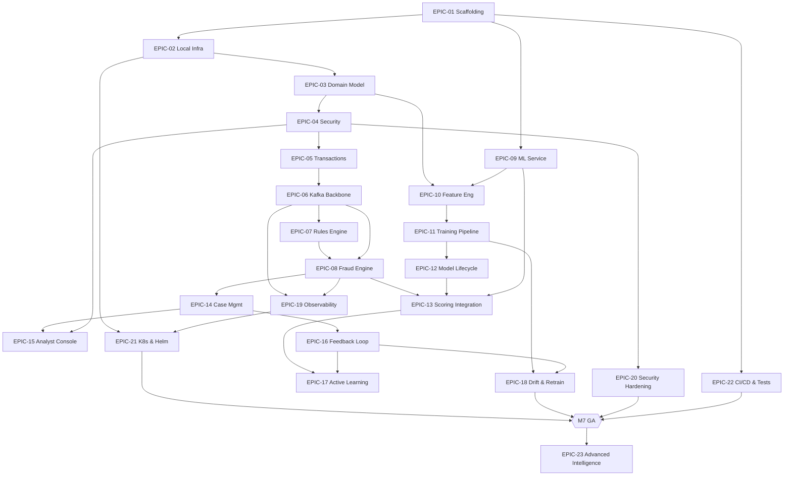
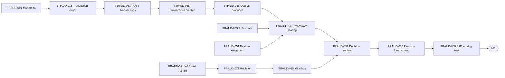

# Fraud Prevention Platform — Linear Project Plan

**Package root:** `com.bragdev.frauddetection`
**Owner:** BragDev LLC
**Horizon:** 6–12 month implementation roadmap
**Methodology:** Agile / Scrum, 2-week sprints
**Status:** Draft for review

An enterprise-grade, AI-powered fraud prevention platform that scores transactions in real time, combines ML risk scoring with a deterministic rules engine, supports human-in-the-loop investigation, and continuously retrains itself from analyst feedback while watching for concept drift.

---

## 1. How to read this document

Work is organized **Phase → Epic → Ticket**. All epics are catalogued first (Section 7), followed by the full ticket breakdown grouped by phase (Sections 9–16). Every ticket carries the seven required fields: Description, Business Value, Acceptance Criteria, Technical Notes, Dependencies, and Estimated Complexity.

This is structured for direct paste into Linear's issue-creation workflow or CSV import. A field-mapping guide for CSV import is in Section 18.

---

## 2. Team & capacity

| Role                                       | Count | Tag          |
|--------------------------------------------|-------|--------------|
| Backend Engineer (Java 26 / Spring Boot 4) | 2     | `BE1`, `BE2` |
| ML Engineer (Python)                       | 1     | `ML`         |
| DevOps Engineer                            | 1     | `DO`         |
| Frontend Engineer                          | 1     | `FE`         |
| QA Engineer                                | 1     | `QA`         |

| Primary scope                                                |
|--------------------------------------------------------------|
| Transaction, rules, fraud engine, case mgmt, Kafka, security |
| ML service, feature store, training, drift, MLflow           |
| Docker, K8s, Helm, CI/CD, observability, secrets             |
| Analyst console, dashboards, case UI                         |
| Test strategy, automation, contract/perf/security tests      |

**Cadence:** 2-week sprints. Capacity assumes ~8 effective story-points per engineer per sprint. The ML track runs partly in parallel with backend foundation work (data + feature engineering can begin once the transaction schema is frozen).

---

## 3. Estimation scale (Estimated Complexity)

| Size | Meaning                                        | Rough effort |
|------|------------------------------------------------|--------------|
| XS   | Trivial, well-understood                       | < 0.5 day    |
| S    | Small, isolated change                         | 0.5–1 day    |
| M    | Moderate, some integration                     | 2–3 days     |
| L    | Large, multi-component                         | 4–6 days     |
| XL   | Very large, cross-cutting (consider splitting) | 1.5–2+ weeks |

---

## 4. Conventions

- **Epic IDs:** `EPIC-01` … `EPIC-23`
- **Ticket IDs:** `FRAUD-001` … (sequential, in phase reading order)
- **Issue types:** `Epic`, `Feature`, `Story`, `Technical Task`, `Spike`, `Infrastructure`
- **Suggested Linear labels:** `phase:1`–`phase:8`, `domain:transactions`, `domain:rules`, `domain:fraud-engine`, `domain:ml`, `domain:case-mgmt`, `domain:feedback`, `domain:drift`, `domain:security`, `domain:observability`, `domain:infra`, `type:spike`, `type:tech-task`, `type:infra`, `team:backend`, `team:ml`, `team:devops`, `team:frontend`, `team:qa`
- **Workflow states:** `Backlog → Todo → In Progress → In Review → QA → Done`
- **Definition of Done (global):** code merged, unit + integration tests green, OpenAPI/contract updated, observability hooks present (metrics/logs), security review passed where applicable, docs updated.

---

## 5. Milestones

| Milestone                              | Target        |
|----------------------------------------|---------------|
| M0 — Bootstrap                         | End Sprint 1  |
| M1 — Foundation complete               | End Sprint 2  |
| M2 — Transactions + Rules MVP          | End Sprint 4  |
| M3 — Real-time scoring MVP             | End Sprint 7  |
| M4 — Case management live              | End Sprint 8  |
| M5 — Closed-loop learning              | End Sprint 9  |
| M6 — Observability & security hardened | End Sprint 10 |
| M7 — Production readiness / GA         | End Sprint 12 |
| M8 — Advanced intelligence             | Post-GA       |

### Milestone Exit Criteria

| Exit Criteria                                                        |
|----------------------------------------------------------------------|
| Monorepo, build system, CI skeleton, local Docker Compose stack runs |
| Domain model, migrations, JWT/RBAC, core entities persisted          |
| Transactions ingested, persisted, events published, rules scoring    |
| ML + rules risk decision on live transactions, explainability stub   |
| Cases auto-created, analyst assignment and review workflow           |
| Feedback ingested, retraining triggered, drift monitored             |
| Dashboards, alerting, audit trail, secrets management, scans         |
| K8s + Helm, test matrix, load testing, backups                       |
| Graph detection, SHAP/LIME, Flink, multi-region/tenant               |

---

## 6. Suggested Sprint Allocation

| Sprint | Focus                                            |
|--------|--------------------------------------------------|
| 1      | Phase 1 — scaffolding, build, local infra        |
| 2      | Phase 1 — domain model, security                 |
| 3      | Phase 2 — transaction processing, Kafka backbone |
| 4      | Phase 2 — rules engine, fraud decision skeleton  |
| 5      | Phase 2 finish + ML service foundation           |
| 6      | Feature store and training pipeline              |
| 7      | Model lifecycle and scoring integration          |
| 8      | Case management and analyst console              |
| 9      | Feedback loop, active learning, drift            |
| 10     | Observability and security hardening             |
| 11     | K8s/Helm and CI/CD quality gates                 |
| 12     | Test matrix, performance, backup, GA hardening   |
| 13+    | Advanced intelligence backlog                    |

### Sprint Ownership

| Sprint | Lead Tracks |
|--------|-------------|
| 1      | DO + BE     |
| 2      | BE + ML     |
| 3      | BE + DO     |
| 4      | BE + ML     |
| 5      | BE + ML     |
| 6      | ML + BE     |
| 7      | ML + BE     |
| 8      | BE + FE     |
| 9      | ML + BE     |
| 10     | DO + BE     |
| 11     | DO + QA     |
| 12     | QA + All    |
| 13+    | ML + BE     |

> QA and observability work are continuous from Sprint 3 onward.

---

## 7. Epic Catalog

| Epic    | Title                                  |
|---------|----------------------------------------|
| EPIC-01 | Project Scaffolding & Build System     |
| EPIC-02 | Local Dev Environment & Infrastructure |
| EPIC-03 | Domain Model & Persistence             |
| EPIC-04 | Security Foundation (AuthN/AuthZ)      |
| EPIC-05 | Transaction Processing Service         |
| EPIC-06 | Event Streaming Backbone (Kafka)       |
| EPIC-07 | Rules Engine                           |
| EPIC-08 | Fraud Detection Engine                 |
| EPIC-09 | ML Service Foundation                  |
| EPIC-10 | ML Data & Feature Engineering          |
| EPIC-11 | Model Training & Evaluation Pipeline   |
| EPIC-12 | Model Lifecycle & Registry             |
| EPIC-13 | Fraud Engine ↔ ML Integration          |
| EPIC-14 | Case Management Service                |
| EPIC-15 | Analyst Console                        |
| EPIC-16 | Human-in-the-Loop Feedback             |
| EPIC-17 | Active Learning                        |
| EPIC-18 | Drift Detection & Retraining           |
| EPIC-19 | Observability & Operations             |
| EPIC-20 | Security Hardening & Audit             |
| EPIC-21 | Kubernetes & Helm Deployment           |
| EPIC-22 | CI/CD, Testing & Quality Gates         |
| EPIC-23 | Advanced Intelligence                  |

### Epic Details

| Epic    | Phase | Lead  | Depends On                |
|---------|-------|-------|---------------------------|
| EPIC-01 | 1     | DO/BE | —                         |
| EPIC-02 | 1     | DO    | EPIC-01                   |
| EPIC-03 | 1     | BE    | EPIC-01, EPIC-02          |
| EPIC-04 | 1     | BE    | EPIC-03                   |
| EPIC-05 | 2     | BE    | EPIC-03, EPIC-04          |
| EPIC-06 | 2     | BE/DO | EPIC-02, EPIC-05          |
| EPIC-07 | 2     | BE    | EPIC-05, EPIC-06          |
| EPIC-08 | 2     | BE    | EPIC-06, EPIC-07          |
| EPIC-09 | 3     | ML    | EPIC-01                   |
| EPIC-10 | 3     | ML    | EPIC-03, EPIC-09          |
| EPIC-11 | 3     | ML    | EPIC-10                   |
| EPIC-12 | 3     | ML/BE | EPIC-11                   |
| EPIC-13 | 3     | BE/ML | EPIC-08, EPIC-09, EPIC-12 |
| EPIC-14 | 4     | BE    | EPIC-08                   |
| EPIC-15 | 4     | FE    | EPIC-14, EPIC-04          |
| EPIC-16 | 5     | BE/ML | EPIC-14                   |
| EPIC-17 | 5     | ML    | EPIC-13, EPIC-16          |
| EPIC-18 | 5     | ML    | EPIC-11, EPIC-16          |
| EPIC-19 | 6     | DO    | EPIC-06, EPIC-08          |
| EPIC-20 | 6     | BE/DO | EPIC-04                   |
| EPIC-21 | 7     | DO    | EPIC-02, EPIC-19          |
| EPIC-22 | 7     | QA/DO | EPIC-01                   |
| EPIC-23 | 8     | ML/BE | M7 (GA)                   |

## 8. Epic dependency graph



---

# PHASE 1 — FOUNDATION

> Goal: a buildable, testable monorepo with the full local stack (Postgres, Redis, Kafka), the complete domain model, and authentication/authorization in place. Exit = **M1**.

## EPIC-01 — Project Scaffolding & Build System
*Phase 1 · Lead: DO/BE · Depends on: —*

Stand up the monorepo, build system, base application modules, and API documentation tooling so every other stream has a place to land code.

### FRAUD-001 — Initialize Gradle Kotlin DSL multi-module monorepo
**Type:** Infrastructure · **Epic:** EPIC-01 · **Complexity:** M · **Owner:** DO
**Description:** Create the monorepo with Gradle (Kotlin DSL), version catalog, and modules: `app`, `common`, `transactions`, `rules`, `fraud-engine`, `case-management`, `security`, plus a separate `ml-service` (Python).
**Business Value:** A consistent, reproducible build is the foundation for parallel team delivery and CI.
**Acceptance Criteria:**
- `./gradlew build` succeeds from a clean checkout.
- Version catalog (`libs.versions.toml`) centralizes dependency versions.
- Module boundaries and package root `com.bragdev.frauddetection` enforced.
**Technical Notes:** Java 26 toolchain, Gradle wrapper pinned. Use convention plugins for shared build logic.
**Dependencies:** —

### FRAUD-002 — Base Spring Boot 4.0.6 application module
**Type:** Technical Task · **Epic:** EPIC-01 · **Complexity:** M · **Owner:** BE1
**Description:** Configure the runnable Spring Boot 4.0.6 `app` module wiring Web, Validation, Data JPA, Actuator, and Security starters.
**Business Value:** Provides the runtime shell all backend features deploy into.
**Acceptance Criteria:**
- Application boots with a `/actuator/health` endpoint returning UP.
- Profiles `local`, `dev`, `prod` resolve correctly.
- Graceful shutdown enabled.
**Technical Notes:** Spring Boot 4 baseline; confirm Jakarta EE 11 / Spring Framework 7 compatibility across starters.
**Dependencies:** FRAUD-001

### FRAUD-003 — OpenAPI / springdoc baseline
**Type:** Technical Task · **Epic:** EPIC-01 · **Complexity:** S · **Owner:** BE1
**Description:** Wire springdoc-openapi to auto-generate and serve the API spec and Swagger UI.
**Business Value:** Contract-first APIs enable frontend and QA to work against a stable spec.
**Acceptance Criteria:**
- `/v3/api-docs` and Swagger UI available in non-prod profiles.
- Spec includes security schemes (bearer JWT).
**Technical Notes:** Group endpoints by domain tag; export spec artifact in CI for contract tests.
**Dependencies:** FRAUD-002

### FRAUD-004 — Code quality tooling & pre-commit gates
**Type:** Technical Task · **Epic:** EPIC-01 · **Complexity:** S · **Owner:** DO
**Description:** Add Spotless, Checkstyle, and a static analysis pass (e.g., error-prone/SpotBugs) plus a pre-commit hook.
**Business Value:** Keeps the codebase consistent and catches defects before review.
**Acceptance Criteria:**
- Formatting + lint run via `./gradlew check`.
- CI fails on violations.
**Technical Notes:** Mirror the same lint config in `ml-service` (ruff + black).
**Dependencies:** FRAUD-001

### FRAUD-005 — Shared `common` module (error model, DTO base, MapStruct config)
**Type:** Technical Task · **Epic:** EPIC-01 · **Complexity:** M · **Owner:** BE2
**Description:** Define cross-cutting primitives: standardized error/response envelope, problem-detail mapping, pagination contracts, and shared MapStruct configuration.
**Business Value:** Consistent API surface and reduced duplication across domains.
**Acceptance Criteria:**
- RFC 7807 problem-detail error responses standardized.
- Shared pagination + sorting DTOs.
**Technical Notes:** Centralize a `@RestControllerAdvice` exception handler here.
**Dependencies:** FRAUD-002

### FRAUD-006 — Bootstrap Python ML service structure
**Type:** Infrastructure · **Epic:** EPIC-01 · **Complexity:** S · **Owner:** ML
**Description:** Initialize the FastAPI `ml-service` project (dependency management, lint/test scaffolding, app entrypoint).
**Business Value:** Gives the ML track an independent, deployable unit from day one.
**Acceptance Criteria:**
- `uvicorn` boots a stub app exposing `/health`.
- Test + lint commands defined.
**Technical Notes:** Pin Python deps (FastAPI, XGBoost, scikit-learn, pandas, numpy, MLflow) in a lockfile.
**Dependencies:** FRAUD-001

---

## EPIC-02 — Local Dev Environment & Core Infrastructure
*Phase 1 · Lead: DO · Depends on: EPIC-01*

A one-command local stack so engineers can run Postgres, Redis, and Kafka identically to higher environments.

### FRAUD-007 — Docker Compose stack (Postgres, Redis, Kafka)
**Type:** Infrastructure · **Epic:** EPIC-02 · **Complexity:** M · **Owner:** DO
**Description:** Author `docker-compose.yml` provisioning Postgres, Redis, and Kafka (KRaft mode) with healthchecks and named volumes.
**Business Value:** Eliminates "works on my machine"; accelerates onboarding.
**Acceptance Criteria:**
- `docker compose up` brings all services healthy.
- Data persists across restarts via volumes.
**Technical Notes:** Prefer KRaft (no ZooKeeper). Expose stable host ports; provide `.env.example`.
**Dependencies:** FRAUD-001

### FRAUD-008 — PostgreSQL config & connection pooling
**Type:** Infrastructure · **Epic:** EPIC-02 · **Complexity:** S · **Owner:** DO
**Description:** Configure datasource, HikariCP pool sizing, and per-profile credentials.
**Business Value:** Reliable, performant DB access under load.
**Acceptance Criteria:**
- Pool sizing tuned and documented.
- Connection validated on startup.
**Technical Notes:** Separate read/write timeouts; statement timeout set defensively.
**Dependencies:** FRAUD-007

### FRAUD-009 — Redis setup & Spring Data Redis config
**Type:** Infrastructure · **Epic:** EPIC-02 · **Complexity:** S · **Owner:** DO
**Description:** Configure Redis connection (Lettuce), serialization, and TTL conventions for caching/velocity counters.
**Business Value:** Backbone for low-latency velocity checks and caching.
**Acceptance Criteria:**
- Redis reachable from the app; round-trip smoke test passes.
- Key namespace + TTL conventions documented.
**Technical Notes:** Reserve key prefixes per domain (e.g., `velocity:`, `cache:`).
**Dependencies:** FRAUD-007

### FRAUD-010 — Kafka topics & local broker config
**Type:** Infrastructure · **Epic:** EPIC-02 · **Complexity:** M · **Owner:** DO
**Description:** Define topic creation (partitions/replication for local), Spring Kafka producer/consumer defaults, and serialization (JSON/Avro decision).
**Business Value:** Event backbone enabling async, decoupled fraud processing.
**Acceptance Criteria:**
- All seven domain topics auto-created locally.
- Producer/consumer smoke test round-trips a message.
**Technical Notes:** Topics: `transactions.created`, `fraud.scored`, `fraud.review.required`, `fraud.confirmed`, `fraud.falsepositive`, `fraud.retraining.requested`, `fraud.model.deployed`.
**Dependencies:** FRAUD-007

### FRAUD-011 — Centralized configuration & profiles
**Type:** Technical Task · **Epic:** EPIC-02 · **Complexity:** M · **Owner:** BE2
**Description:** Establish 12-factor configuration: externalized env vars, profile-specific YAML, and a typed `@ConfigurationProperties` layer.
**Business Value:** Safe, consistent configuration across environments.
**Acceptance Criteria:**
- No secrets in source; all env-driven.
- Config validated at startup (fail fast).
**Technical Notes:** Document required env vars; integrate with secrets store later (FRAUD-030, EPIC-20).
**Dependencies:** FRAUD-002, FRAUD-007

### FRAUD-012 — One-command local bring-up (task runner)
**Type:** Infrastructure · **Epic:** EPIC-02 · **Complexity:** S · **Owner:** DO
**Description:** Provide a Makefile/Taskfile to build, start the stack, run migrations, and seed sample data.
**Business Value:** Fast, repeatable developer loop.
**Acceptance Criteria:**
- `make up` yields a fully running local environment with seed data.
**Technical Notes:** Include `make seed`, `make reset`, `make logs` targets.
**Dependencies:** FRAUD-007, FRAUD-024

---

## EPIC-03 — Domain Model & Persistence
*Phase 1 · Lead: BE · Depends on: EPIC-01, EPIC-02*

The canonical data model and migrations for every core entity, with mappers and a versioned migration pipeline.

### FRAUD-013 — Spike: ERD & migration strategy
**Type:** Spike · **Epic:** EPIC-03 · **Complexity:** S · **Owner:** BE1
**Description:** Produce the entity-relationship diagram, identify keys/indexes, and decide on UUID vs sequence IDs and soft-delete/audit columns.
**Business Value:** Prevents costly schema rework downstream.
**Acceptance Criteria:**
- Approved ERD covering all nine entities.
- Indexing and PK strategy documented.
**Technical Notes:** Favor UUIDv7 for time-sortable IDs; standard `created_at`/`updated_at`/`version` columns.
**Dependencies:** FRAUD-008

### FRAUD-014 — User entity & migration
**Type:** Story · **Epic:** EPIC-03 · **Complexity:** M · **Owner:** BE1
**Description:** Implement `User` (identity, role, status) JPA entity, repository, and Flyway migration.
**Business Value:** Anchors authentication, RBAC, and audit attribution.
**Acceptance Criteria:**
- Entity persists and is uniquely constrained on username/email.
- Migration applies cleanly forward.
**Technical Notes:** Store only password hashes; role as enum mapped to RBAC (EPIC-04).
**Dependencies:** FRAUD-013

### FRAUD-015 — Transaction entity & migration
**Type:** Story · **Epic:** EPIC-03 · **Complexity:** M · **Owner:** BE2
**Description:** Implement `Transaction` (amount, currency, timestamps, merchant/device/user refs, status) entity, repository, and migration.
**Business Value:** Central record everything else scores and references.
**Acceptance Criteria:**
- Indexed on user, merchant, device, and created time.
- Monetary values use precise decimal types.
**Technical Notes:** Avoid floating point for money; partition-ready design for high volume.
**Dependencies:** FRAUD-013

### FRAUD-016 — Device entity & migration
**Type:** Story · **Epic:** EPIC-03 · **Complexity:** S · **Owner:** BE2
**Description:** Implement `Device` (fingerprint, type, first/last seen, trust signals) entity, repository, and migration.
**Business Value:** Enables device-based fraud rules and risk features.
**Acceptance Criteria:**
- Unique device fingerprint constraint.
- Linkable to users and transactions.
**Technical Notes:** Capture IP/user-agent-derived attributes; keep PII minimal.
**Dependencies:** FRAUD-013

### FRAUD-017 — Merchant entity & migration
**Type:** Story · **Epic:** EPIC-03 · **Complexity:** S · **Owner:** BE2
**Description:** Implement `Merchant` (id, category/MCC, risk tier, geo) entity, repository, and migration.
**Business Value:** Supports merchant-level rules and risk aggregation.
**Acceptance Criteria:**
- MCC and risk tier persisted and queryable.
**Technical Notes:** Seed a reference set of MCC codes.
**Dependencies:** FRAUD-013

### FRAUD-018 — FraudCase entity & migration
**Type:** Story · **Epic:** EPIC-03 · **Complexity:** M · **Owner:** BE1
**Description:** Implement `FraudCase` (status, severity, assignee, linked transaction, lifecycle timestamps) entity, repository, and migration.
**Business Value:** Backbone of human investigation workflow.
**Acceptance Criteria:**
- Case lifecycle states enumerated and constrained.
- Assignable to a user.
**Technical Notes:** Model status as a state machine (see EPIC-14).
**Dependencies:** FRAUD-013, FRAUD-014, FRAUD-015

### FRAUD-019 — FraudLabel entity & migration
**Type:** Story · **Epic:** EPIC-03 · **Complexity:** S · **Owner:** BE1
**Description:** Implement `FraudLabel` (label value, source analyst, confidence, timestamp, linked transaction/case) entity and migration.
**Business Value:** Ground-truth store powering retraining and metrics.
**Acceptance Criteria:**
- Labels link to both transaction and case.
- Immutable once created (append-only).
**Technical Notes:** Append-only; supersession via new rows, never updates.
**Dependencies:** FRAUD-013, FRAUD-015, FRAUD-018

### FRAUD-020 — RiskScore entity & migration
**Type:** Story · **Epic:** EPIC-03 · **Complexity:** S · **Owner:** BE2
**Description:** Implement `RiskScore` (transaction ref, ml_score, rules_score, aggregate, decision, model version, timestamp) entity and migration.
**Business Value:** Auditable record of every scoring decision.
**Acceptance Criteria:**
- Stores component scores + final decision + model version.
**Technical Notes:** Link to `ModelVersion`; index by transaction and created time.
**Dependencies:** FRAUD-013, FRAUD-015, FRAUD-022

### FRAUD-021 — AuditEvent entity & migration
**Type:** Story · **Epic:** EPIC-03 · **Complexity:** S · **Owner:** BE1
**Description:** Implement append-only `AuditEvent` (actor, action, target, before/after, timestamp, correlation id) entity and migration.
**Business Value:** Regulatory-grade audit trail across the platform.
**Acceptance Criteria:**
- Append-only; no update/delete paths.
- Correlation id captured for traceability.
**Technical Notes:** Consider hash-chaining rows for tamper evidence (revisit in EPIC-20).
**Dependencies:** FRAUD-013

### FRAUD-022 — ModelVersion entity & migration
**Type:** Story · **Epic:** EPIC-03 · **Complexity:** S · **Owner:** ML
**Description:** Implement `ModelVersion` (version, MLflow run id, metrics snapshot, status, deployed_at) entity and migration.
**Business Value:** Connects scoring decisions to specific, reproducible models.
**Acceptance Criteria:**
- Tracks lifecycle status (registered/approved/deployed/rolled-back).
**Technical Notes:** Mirrors MLflow registry; source of truth for currently-serving version.
**Dependencies:** FRAUD-013

### FRAUD-023 — MapStruct mappers & DTO layer
**Type:** Technical Task · **Epic:** EPIC-03 · **Complexity:** M · **Owner:** BE2
**Description:** Generate entity↔DTO mappers for all core entities and define request/response DTOs.
**Business Value:** Clean separation between persistence and API contracts.
**Acceptance Criteria:**
- No entities leak across the API boundary.
- Mappers unit-tested.
**Technical Notes:** Use shared MapStruct config from FRAUD-005.
**Dependencies:** FRAUD-014, FRAUD-015, FRAUD-016, FRAUD-017, FRAUD-018, FRAUD-019, FRAUD-020, FRAUD-021, FRAUD-022

### FRAUD-024 — Flyway baseline & migration CI check
**Type:** Infrastructure · **Epic:** EPIC-03 · **Complexity:** S · **Owner:** DO
**Description:** Establish Flyway baseline, naming conventions, and a CI step that validates migrations against an ephemeral DB.
**Business Value:** Safe, ordered, reviewable schema evolution.
**Acceptance Criteria:**
- Migrations versioned and validated in CI.
- Out-of-order/missing migrations fail the build.
**Technical Notes:** Use Testcontainers Postgres for the CI validation.
**Dependencies:** FRAUD-008, FRAUD-013

---

## EPIC-04 — Security Foundation (AuthN/AuthZ)
*Phase 1 · Lead: BE · Depends on: EPIC-03*

JWT authentication, role-based authorization, and service-to-service identity for the five roles.

### FRAUD-025 — JWT authentication
**Type:** Story · **Epic:** EPIC-04 · **Complexity:** L · **Owner:** BE1
**Description:** Implement JWT issuance and validation with Spring Security (login, token signing, refresh, expiry).
**Business Value:** Secures all platform access with a standard, stateless mechanism.
**Acceptance Criteria:**
- Valid credentials yield a signed JWT; invalid/expired tokens are rejected.
- Refresh flow implemented; clock-skew tolerance configured.
**Technical Notes:** Asymmetric signing (RS256); keys sourced from secrets store (EPIC-20).
**Dependencies:** FRAUD-014

### FRAUD-026 — RBAC model & role definitions
**Type:** Story · **Epic:** EPIC-04 · **Complexity:** M · **Owner:** BE1
**Description:** Define roles and permission sets for Admin, Fraud Analyst, Investigator, Auditor, and System Account.
**Business Value:** Enforces least-privilege access aligned to job function.
**Acceptance Criteria:**
- Each role maps to a documented permission matrix.
- Roles assignable to users.
**Technical Notes:** Authorities/scopes embedded in JWT claims.
**Dependencies:** FRAUD-025

### FRAUD-027 — Endpoint authorization matrix
**Type:** Story · **Epic:** EPIC-04 · **Complexity:** M · **Owner:** BE2
**Description:** Apply method/endpoint-level authorization across all current and planned APIs per the role matrix.
**Business Value:** Prevents privilege escalation and unauthorized data access.
**Acceptance Criteria:**
- Protected endpoints reject unauthorized roles (403) and unauthenticated calls (401).
- Authorization covered by tests.
**Technical Notes:** `@PreAuthorize` with centralized policy expressions; document the matrix.
**Dependencies:** FRAUD-026

### FRAUD-028 — System (service) account authentication
**Type:** Story · **Epic:** EPIC-04 · **Complexity:** M · **Owner:** BE2
**Description:** Provide a System Account identity and credential flow for internal/service-to-service calls (e.g., scoring callbacks).
**Business Value:** Secures internal traffic without human credentials.
**Acceptance Criteria:**
- Service token issued and scoped to system permissions only.
**Technical Notes:** Client-credentials-style flow; short-lived tokens.
**Dependencies:** FRAUD-026

### FRAUD-029 — Security context propagation
**Type:** Technical Task · **Epic:** EPIC-04 · **Complexity:** M · **Owner:** BE1
**Description:** Propagate authenticated principal + correlation id through synchronous calls and into Kafka message headers.
**Business Value:** Enables end-to-end attribution and audit across async boundaries.
**Acceptance Criteria:**
- Principal and correlation id available in consumers and audit events.
**Technical Notes:** MDC + Kafka header enrichment; ties into EPIC-19 tracing.
**Dependencies:** FRAUD-025

### FRAUD-030 — Spike: secrets handling (local vs prod)
**Type:** Spike · **Epic:** EPIC-04 · **Complexity:** S · **Owner:** DO
**Description:** Evaluate secrets management options and recommend an approach for keys, DB creds, and signing material.
**Business Value:** De-risks credential handling before production.
**Acceptance Criteria:**
- Recommendation documented; spike implemented as a stub for local.
**Technical Notes:** Candidates: Kubernetes Secrets + external operator (e.g., External Secrets/Vault). Full implementation in EPIC-20.
**Dependencies:** FRAUD-011

---

# PHASE 2 — CORE FRAUD ENGINE

> Goal: ingest and persist transactions, emit events, run deterministic rule checks, and orchestrate a combined risk decision. Exit = **M2**, with the engine skeleton ready for ML integration in Phase 3.

## EPIC-05 — Transaction Processing Service
*Phase 2 · Lead: BE · Depends on: EPIC-03, EPIC-04*

Receive, validate, persist, and emit transactions — the entry point of the entire pipeline.

### FRAUD-031 — POST /transactions (ingest endpoint)
**Type:** Story · **Epic:** EPIC-05 · **Complexity:** M · **Owner:** BE2
**Description:** Implement `POST /transactions` to accept a transaction, validate it, persist it, and trigger event publication.
**Business Value:** The front door for all transaction data entering the platform.
**Acceptance Criteria:**
- Valid request returns 201 with the created resource + id.
- Invalid request returns 400 with problem-detail errors.
- Endpoint secured per role matrix.
**Technical Notes:** Synchronous persist + async event publish (outbox, FRAUD-038).
**Dependencies:** FRAUD-015, FRAUD-027, FRAUD-033

### FRAUD-032 — GET /transactions/{id}
**Type:** Story · **Epic:** EPIC-05 · **Complexity:** S · **Owner:** BE2
**Description:** Retrieve a single transaction with its latest risk score and decision.
**Business Value:** Lets analysts and services inspect transaction state.
**Acceptance Criteria:**
- Returns 200 with transaction + latest RiskScore, 404 if not found.
**Technical Notes:** Join latest `RiskScore`; respect RBAC field visibility.
**Dependencies:** FRAUD-031, FRAUD-020

### FRAUD-033 — Transaction request validation
**Type:** Technical Task · **Epic:** EPIC-05 · **Complexity:** S · **Owner:** BE2
**Description:** Define Spring Validation constraints (amount > 0, currency ISO-4217, required refs, timestamp sanity).
**Business Value:** Stops malformed/garbage data at the boundary.
**Acceptance Criteria:**
- All constraints enforced with clear field-level errors.
**Technical Notes:** Custom validators for currency and merchant/device existence.
**Dependencies:** FRAUD-005

### FRAUD-034 — Transaction persistence service & idempotency
**Type:** Story · **Epic:** EPIC-05 · **Complexity:** M · **Owner:** BE2
**Description:** Implement the service layer for persistence with idempotency keys to safely handle retries/duplicates.
**Business Value:** Prevents double-processing and duplicate charges in the pipeline.
**Acceptance Criteria:**
- Duplicate submission with same idempotency key returns the original result.
**Technical Notes:** Idempotency key stored uniquely; short-TTL Redis guard for in-flight.
**Dependencies:** FRAUD-015, FRAUD-009

### FRAUD-035 — Publish `transactions.created` event
**Type:** Story · **Epic:** EPIC-05 · **Complexity:** M · **Owner:** BE2
**Description:** Emit a `transactions.created` event after successful persistence so the fraud engine can score asynchronously.
**Business Value:** Decouples ingestion from scoring; enables horizontal scaling.
**Acceptance Criteria:**
- Event published reliably with transaction payload + correlation id.
**Technical Notes:** Use transactional outbox to avoid dual-write inconsistency.
**Dependencies:** FRAUD-034, FRAUD-038

### FRAUD-036 — Resilience on transaction write path
**Type:** Technical Task · **Epic:** EPIC-05 · **Complexity:** S · **Owner:** BE1
**Description:** Apply Resilience4j (timeouts, retry, bulkhead) to DB and downstream calls on the ingest path.
**Business Value:** Keeps ingestion responsive and stable under partial failures.
**Acceptance Criteria:**
- Configured retry/timeout/bulkhead with sensible defaults; surfaced in metrics.
**Technical Notes:** Avoid retrying non-idempotent operations without keys.
**Dependencies:** FRAUD-034

---

## EPIC-06 — Event Streaming Backbone (Kafka)
*Phase 2 · Lead: BE/DO · Depends on: EPIC-02, EPIC-05*

Reliable, observable event production/consumption with outbox, DLQs, and idempotency.

### FRAUD-037 — Event schemas & serialization
**Type:** Technical Task · **Epic:** EPIC-06 · **Complexity:** M · **Owner:** BE1
**Description:** Define versioned schemas for all seven topics and choose serialization (JSON Schema vs Avro + registry).
**Business Value:** Stable, evolvable contracts between producers and consumers.
**Acceptance Criteria:**
- Schemas documented and validated; versioning/compat policy defined.
**Technical Notes:** Recommend Avro + schema registry for compatibility enforcement; include event envelope (id, type, version, correlation id, occurredAt).
**Dependencies:** FRAUD-010

### FRAUD-038 — Producer abstraction + transactional outbox
**Type:** Story · **Epic:** EPIC-06 · **Complexity:** L · **Owner:** BE1
**Description:** Implement a reusable producer with the transactional outbox pattern to guarantee at-least-once publication aligned with DB commits.
**Business Value:** Eliminates lost or phantom events from dual writes.
**Acceptance Criteria:**
- Events persisted to outbox in the same tx; relay publishes and marks sent.
- No event published for a rolled-back transaction.
**Technical Notes:** Polling or CDC-based relay; idempotent re-publish on relay restart.
**Dependencies:** FRAUD-037, FRAUD-024

### FRAUD-039 — Consumer framework + retry
**Type:** Story · **Epic:** EPIC-06 · **Complexity:** M · **Owner:** BE2
**Description:** Standardize consumers with error handling, backoff retry, and concurrency configuration.
**Business Value:** Resilient async processing across all domains.
**Acceptance Criteria:**
- Transient failures retried with backoff; permanent failures routed to DLQ.
**Technical Notes:** Spring Kafka `DefaultErrorHandler` + `BackOff`; per-listener concurrency.
**Dependencies:** FRAUD-037

### FRAUD-040 — Dead-letter topics & poison handling
**Type:** Technical Task · **Epic:** EPIC-06 · **Complexity:** M · **Owner:** BE2
**Description:** Provision DLQs per consumer and a replay/inspection path for failed messages.
**Business Value:** Failures are contained and recoverable, not lost.
**Acceptance Criteria:**
- Poison messages land in DLQ with failure metadata; replay tool documented.
**Technical Notes:** Capture original headers + exception; alert on DLQ growth (EPIC-19).
**Dependencies:** FRAUD-039

### FRAUD-041 — Spike: delivery semantics
**Type:** Spike · **Epic:** EPIC-06 · **Complexity:** S · **Owner:** BE1
**Description:** Determine the required delivery guarantee (at-least-once + idempotent consumers vs exactly-once) per topic and document trade-offs.
**Business Value:** Right-sizes complexity vs correctness for financial events.
**Acceptance Criteria:**
- Decision recorded with rationale and consumer idempotency requirements.
**Technical Notes:** Idempotent consumers via dedupe keys are usually sufficient and cheaper than EOS.
**Dependencies:** FRAUD-037

### FRAUD-042 — Topic governance
**Type:** Infrastructure · **Epic:** EPIC-06 · **Complexity:** S · **Owner:** DO
**Description:** Codify partition counts, replication, retention, and keying strategy per topic as infra-as-code.
**Business Value:** Predictable ordering, throughput, and storage behavior.
**Acceptance Criteria:**
- Topic configs declared and applied consistently across environments.
**Technical Notes:** Key by transaction/user id for ordering where required.
**Dependencies:** FRAUD-010

---

## EPIC-07 — Rules Engine
*Phase 2 · Lead: BE · Depends on: EPIC-05, EPIC-06*

Deterministic, configurable fraud checks that run fast and explainably alongside ML.

### FRAUD-043 — Rules engine core abstraction
**Type:** Story · **Epic:** EPIC-07 · **Complexity:** L · **Owner:** BE1
**Description:** Build the rule SPI, evaluation context, and execution pipeline that runs a configurable set of checks and produces per-rule outcomes + weights.
**Business Value:** Extensible framework so new rules ship without engine rewrites.
**Acceptance Criteria:**
- Rules pluggable via a common interface; execution produces structured outcomes.
- Each rule returns score contribution + reason code.
**Technical Notes:** Favor a simple typed SPI over a heavyweight rules DSL initially; deterministic ordering.
**Dependencies:** FRAUD-015, FRAUD-009

### FRAUD-044 — Velocity checks
**Type:** Story · **Epic:** EPIC-07 · **Complexity:** M · **Owner:** BE1
**Description:** Implement velocity rules (transactions/amount per user/device/card over sliding windows) backed by Redis counters.
**Business Value:** Catches rapid-fire fraud patterns in real time.
**Acceptance Criteria:**
- Sliding-window counts computed within latency budget; thresholds configurable.
**Technical Notes:** Redis sorted sets / TTL counters; document window sizes.
**Dependencies:** FRAUD-043

### FRAUD-045 — Device checks
**Type:** Story · **Epic:** EPIC-07 · **Complexity:** M · **Owner:** BE2
**Description:** Implement rules for new/unrecognized devices, device-sharing across many users, and untrusted fingerprints.
**Business Value:** Flags account-takeover and device-farm patterns.
**Acceptance Criteria:**
- New-device and shared-device conditions produce appropriate reason codes.
**Technical Notes:** Uses `Device` trust signals (FRAUD-016).
**Dependencies:** FRAUD-043, FRAUD-016

### FRAUD-046 — Geographic checks
**Type:** Story · **Epic:** EPIC-07 · **Complexity:** M · **Owner:** BE2
**Description:** Implement geo rules: impossible travel, geo/IP mismatch, and high-risk regions.
**Business Value:** Detects location-anomaly fraud.
**Acceptance Criteria:**
- Impossible-travel detection between consecutive transactions works with configurable speed limits.
**Technical Notes:** Haversine distance vs elapsed time; maintain last-known geo per user.
**Dependencies:** FRAUD-043

### FRAUD-047 — Merchant checks
**Type:** Story · **Epic:** EPIC-07 · **Complexity:** S · **Owner:** BE2
**Description:** Implement merchant risk-tier and MCC-based rules.
**Business Value:** Weights risk by merchant category and reputation.
**Acceptance Criteria:**
- High-risk MCC/tier transactions receive elevated rule scores.
**Technical Notes:** Source from `Merchant` (FRAUD-017).
**Dependencies:** FRAUD-043, FRAUD-017

### FRAUD-048 — Amount threshold checks
**Type:** Story · **Epic:** EPIC-07 · **Complexity:** S · **Owner:** BE1
**Description:** Implement absolute and relative (vs user baseline) amount-threshold rules.
**Business Value:** Flags unusually large or out-of-pattern amounts.
**Acceptance Criteria:**
- Static and baseline-relative thresholds both supported and configurable.
**Technical Notes:** User baseline derived from rolling stats; precise decimal math.
**Dependencies:** FRAUD-043

### FRAUD-049 — Rule configuration & management
**Type:** Story · **Epic:** EPIC-07 · **Complexity:** M · **Owner:** BE1
**Description:** Allow rule parameters/weights/enablement to be configured (and hot-reloaded) without redeploy.
**Business Value:** Lets analysts/admins tune detection as fraud evolves.
**Acceptance Criteria:**
- Rule params editable + versioned; changes audited.
**Technical Notes:** Config in DB with cache + refresh; restrict to Admin role.
**Dependencies:** FRAUD-043, FRAUD-021

### FRAUD-050 — Rules scoring aggregation output
**Type:** Technical Task · **Epic:** EPIC-07 · **Complexity:** S · **Owner:** BE1
**Description:** Aggregate per-rule outcomes into a single rules score + reason-code set consumable by the decision engine.
**Business Value:** Clean, explainable rules signal for the final decision.
**Acceptance Criteria:**
- Deterministic aggregate score + ordered reason codes returned.
**Technical Notes:** Weighted sum/normalization; expose breakdown for audit.
**Dependencies:** FRAUD-044, FRAUD-045, FRAUD-046, FRAUD-047, FRAUD-048

---

## EPIC-08 — Fraud Detection Engine (orchestration)
*Phase 2 · Lead: BE · Depends on: EPIC-06, EPIC-07*

The orchestrator that extracts features, combines rules + ML, decides, persists, and emits outcomes. (ML wired in Phase 3 via EPIC-13.)

### FRAUD-051 — Feature extraction service
**Type:** Story · **Epic:** EPIC-08 · **Complexity:** L · **Owner:** BE1
**Description:** Compute the feature vector for a transaction (aggregates, velocity-derived, device/merchant/geo features) used by both rules and ML.
**Business Value:** Consistent features shared by deterministic and ML paths.
**Acceptance Criteria:**
- Feature vector computed within latency budget and schema-stable.
**Technical Notes:** Must match the ML training feature contract (coordinate with EPIC-10); cache hot aggregates in Redis.
**Dependencies:** FRAUD-015, FRAUD-009, FRAUD-044

### FRAUD-052 — Decision engine
**Type:** Story · **Epic:** EPIC-08 · **Complexity:** L · **Owner:** BE1
**Description:** Combine ML risk score + rules score into a final decision (APPROVE / REVIEW / DECLINE) using configurable policy.
**Business Value:** Turns signals into actionable, consistent outcomes.
**Acceptance Criteria:**
- Decision policy configurable; outcomes reproducible and explained by contributing factors.
**Technical Notes:** Strategy pattern for policy; record component scores in `RiskScore`.
**Dependencies:** FRAUD-050, FRAUD-053

### FRAUD-053 — Risk aggregation & thresholds
**Type:** Story · **Epic:** EPIC-08 · **Complexity:** M · **Owner:** BE2
**Description:** Define how component scores combine and where REVIEW/DECLINE thresholds sit, with configuration.
**Business Value:** Central control of false-positive vs catch-rate trade-off.
**Acceptance Criteria:**
- Thresholds configurable and auditable; defaults documented.
**Technical Notes:** Expose as tunable config (ties to active learning thresholds, EPIC-17).
**Dependencies:** FRAUD-050

### FRAUD-054 — Orchestrate scoring on `transactions.created`
**Type:** Story · **Epic:** EPIC-08 · **Complexity:** M · **Owner:** BE2
**Description:** Consume `transactions.created`, run feature extraction → rules → (ML stub) → decision.
**Business Value:** Wires the end-to-end async scoring flow.
**Acceptance Criteria:**
- Each created transaction produces a decision and persisted score.
**Technical Notes:** ML call stubbed until EPIC-13; idempotent per transaction id.
**Dependencies:** FRAUD-035, FRAUD-051, FRAUD-052, FRAUD-039

### FRAUD-055 — Persist RiskScore & publish `fraud.scored`
**Type:** Story · **Epic:** EPIC-08 · **Complexity:** M · **Owner:** BE2
**Description:** Persist the `RiskScore` record and publish `fraud.scored` with decision + component scores.
**Business Value:** Makes scoring outcomes auditable and consumable downstream.
**Acceptance Criteria:**
- RiskScore persisted with model version; `fraud.scored` emitted.
**Technical Notes:** Via outbox; link to serving `ModelVersion`.
**Dependencies:** FRAUD-054, FRAUD-020, FRAUD-038

### FRAUD-056 — Route high-risk to review
**Type:** Story · **Epic:** EPIC-08 · **Complexity:** M · **Owner:** BE2
**Description:** When a decision is REVIEW (or DECLINE per policy), publish `fraud.review.required` to trigger case creation.
**Business Value:** Connects automated scoring to human investigation.
**Acceptance Criteria:**
- Review-worthy transactions emit `fraud.review.required` with context.
**Technical Notes:** Consumed by Case Management (EPIC-14).
**Dependencies:** FRAUD-055

### FRAUD-057 — Resilience: ML-unavailable fallback
**Type:** Technical Task · **Epic:** EPIC-08 · **Complexity:** M · **Owner:** BE1
**Description:** Apply circuit breaker/timeout on the ML call so scoring degrades gracefully to rules-only when ML is down.
**Business Value:** Keeps fraud decisions flowing during ML outages.
**Acceptance Criteria:**
- ML timeout/open-circuit yields a rules-only decision flagged as degraded.
**Technical Notes:** Resilience4j circuit breaker + fallback; emit degraded-mode metric/alert.
**Dependencies:** FRAUD-052

---

# PHASE 3 — MACHINE LEARNING

> Goal: a Python ML service that trains, evaluates, registers, serves, and explains models, integrated into the fraud engine for real-time scoring. Exit = **M3**.

## EPIC-09 — ML Service Foundation (FastAPI)
*Phase 3 · Lead: ML · Depends on: EPIC-01*

The independently deployable inference service exposing predict/batch/version/health.

### FRAUD-058 — FastAPI service skeleton & `/health`
**Type:** Story · **Epic:** EPIC-09 · **Complexity:** S · **Owner:** ML
**Description:** Stand up the FastAPI app structure, config, logging, and a `GET /health` readiness/liveness endpoint.
**Business Value:** Deployable inference service that orchestration can depend on.
**Acceptance Criteria:**
- `/health` reports model-loaded status and dependency health.
**Technical Notes:** Structured JSON logs; config via env (12-factor).
**Dependencies:** FRAUD-006

### FRAUD-059 — POST /predict
**Type:** Story · **Epic:** EPIC-09 · **Complexity:** M · **Owner:** ML
**Description:** Implement single-transaction scoring: accept a feature payload, return risk probability + contributing factors.
**Business Value:** The real-time scoring primitive for the fraud engine.
**Acceptance Criteria:**
- Returns calibrated probability + model version within latency budget.
- Rejects malformed payloads with 422.
**Technical Notes:** Stateless; model held in memory (FRAUD-061).
**Dependencies:** FRAUD-058, FRAUD-061, FRAUD-063

### FRAUD-060 — POST /batch-predict
**Type:** Story · **Epic:** EPIC-09 · **Complexity:** M · **Owner:** ML
**Description:** Score a batch of transactions efficiently for backfills and offline analysis.
**Business Value:** Enables re-scoring and bulk evaluation.
**Acceptance Criteria:**
- Accepts an array, returns aligned results; bounded batch size enforced.
**Technical Notes:** Vectorized inference with pandas/NumPy.
**Dependencies:** FRAUD-059

### FRAUD-061 — Model loading & in-memory serving
**Type:** Story · **Epic:** EPIC-09 · **Complexity:** M · **Owner:** ML
**Description:** Load the active model artifact at startup and on demand, with warmup and thread-safe access.
**Business Value:** Low-latency serving with controlled model state.
**Acceptance Criteria:**
- Model loads from registry/artifact path; warmup completes before READY.
**Technical Notes:** Lazy + atomic reference swap for hot-reload (FRAUD-087).
**Dependencies:** FRAUD-058

### FRAUD-062 — GET /model/version
**Type:** Story · **Epic:** EPIC-09 · **Complexity:** S · **Owner:** ML
**Description:** Expose the currently serving model version and key metadata.
**Business Value:** Traceability of which model produced which score.
**Acceptance Criteria:**
- Returns version, training run id, and load timestamp.
**Technical Notes:** Sourced from registry metadata (EPIC-12).
**Dependencies:** FRAUD-061

### FRAUD-063 — Request/response schemas & validation
**Type:** Technical Task · **Epic:** EPIC-09 · **Complexity:** S · **Owner:** ML
**Description:** Define Pydantic models for predict/batch payloads enforcing the feature contract.
**Business Value:** Prevents silent feature drift/mismatch at the API boundary.
**Acceptance Criteria:**
- Schema rejects missing/extra/mistyped features.
**Technical Notes:** Version the schema; keep in lockstep with FRAUD-086.
**Dependencies:** FRAUD-058

### FRAUD-064 — ML service observability hooks
**Type:** Technical Task · **Epic:** EPIC-09 · **Complexity:** S · **Owner:** ML
**Description:** Emit Prometheus metrics (latency, throughput, prediction distribution) and structured logs.
**Business Value:** Operability and drift signals for the ML service.
**Acceptance Criteria:**
- `/metrics` exposed; prediction score histogram available.
**Technical Notes:** Feeds dashboards (EPIC-19) and drift monitors (EPIC-18).
**Dependencies:** FRAUD-058

---

## EPIC-10 — ML Data & Feature Engineering
*Phase 3 · Lead: ML · Depends on: EPIC-03, EPIC-09*

Ingestion, feature engineering, and a feature store with offline/online parity.

### FRAUD-065 — Dataset ingestion pipeline
**Type:** Story · **Epic:** EPIC-10 · **Complexity:** M · **Owner:** ML
**Description:** Build ingestion that assembles training datasets from transactions, devices, merchants, and labels.
**Business Value:** Reproducible training data is the basis of model quality.
**Acceptance Criteria:**
- Versioned, reproducible dataset snapshots produced.
**Technical Notes:** Snapshot with data version id; document source queries.
**Dependencies:** FRAUD-015, FRAUD-058

### FRAUD-066 — Feature engineering pipeline
**Type:** Story · **Epic:** EPIC-10 · **Complexity:** L · **Owner:** ML
**Description:** Implement feature transformations (aggregations, velocity, recency, encodings) matching the online feature contract.
**Business Value:** Predictive, consistent features drive detection performance.
**Acceptance Criteria:**
- Feature set documented; transformations unit-tested and deterministic.
**Technical Notes:** Must mirror engine-side features (FRAUD-051) exactly.
**Dependencies:** FRAUD-065

### FRAUD-067 — Feature store
**Type:** Story · **Epic:** EPIC-10 · **Complexity:** L · **Owner:** ML
**Description:** Provide a feature store for offline (training) and online (serving) retrieval with consistent definitions.
**Business Value:** Single source of truth for features; prevents train/serve skew.
**Acceptance Criteria:**
- Same feature definitions served online and offline; point-in-time correctness for training.
**Technical Notes:** Online store backed by Redis; evaluate Feast vs lightweight in-house.
**Dependencies:** FRAUD-066, FRAUD-009

### FRAUD-068 — Offline/online feature parity contract
**Type:** Technical Task · **Epic:** EPIC-10 · **Complexity:** M · **Owner:** ML
**Description:** Define and test a shared feature schema/contract used by training and the engine, with parity checks.
**Business Value:** Eliminates the most common cause of production model degradation.
**Acceptance Criteria:**
- Automated parity test fails on any train/serve feature mismatch.
**Technical Notes:** Shared schema artifact consumed by FRAUD-063 and FRAUD-086.
**Dependencies:** FRAUD-066, FRAUD-051

### FRAUD-069 — Label join for training data
**Type:** Story · **Epic:** EPIC-10 · **Complexity:** M · **Owner:** ML
**Description:** Join `FraudLabel` ground truth to feature rows, handling label timing and supersession.
**Business Value:** Correct labels are essential for supervised retraining.
**Acceptance Criteria:**
- Point-in-time correct labels; latest label wins on supersession.
**Technical Notes:** Avoid label leakage from post-event signals.
**Dependencies:** FRAUD-019, FRAUD-066

### FRAUD-070 — Data validation & quality checks
**Type:** Technical Task · **Epic:** EPIC-10 · **Complexity:** M · **Owner:** ML
**Description:** Validate schema, ranges, null rates, and distribution sanity on ingested/engineered data.
**Business Value:** Stops bad data from silently degrading models.
**Acceptance Criteria:**
- Validation gates the pipeline; violations block training with a report.
**Technical Notes:** e.g., Great Expectations or pandera checks in CI/pipeline.
**Dependencies:** FRAUD-065

---

## EPIC-11 — Model Training & Evaluation Pipeline
*Phase 3 · Lead: ML · Depends on: EPIC-10*

Train, tune, and rigorously evaluate models with experiment tracking.

### FRAUD-071 — XGBoost training pipeline
**Type:** Story · **Epic:** EPIC-11 · **Complexity:** L · **Owner:** ML
**Description:** Implement the end-to-end training pipeline producing a serialized XGBoost model + metadata.
**Business Value:** The core predictive engine of the platform.
**Acceptance Criteria:**
- Reproducible training from a dataset version yields a logged model artifact.
**Technical Notes:** Deterministic seeds; log params/metrics/artifact to MLflow.
**Dependencies:** FRAUD-067, FRAUD-069

### FRAUD-072 — Baseline model & benchmark
**Type:** Story · **Epic:** EPIC-11 · **Complexity:** M · **Owner:** ML
**Description:** Train a simple scikit-learn baseline (e.g., logistic regression) to benchmark XGBoost against.
**Business Value:** Establishes a defensible performance floor and sanity check.
**Acceptance Criteria:**
- Baseline metrics recorded; XGBoost must beat baseline to proceed.
**Technical Notes:** Same features/splits for fair comparison.
**Dependencies:** FRAUD-067, FRAUD-069

### FRAUD-073 — Model evaluation suite
**Type:** Story · **Epic:** EPIC-11 · **Complexity:** M · **Owner:** ML
**Description:** Compute fraud-appropriate metrics: ROC-AUC, PR-AUC, precision/recall at operating points, confusion matrix, and a cost-weighted metric.
**Business Value:** Ensures models are evaluated on what matters for fraud, not just accuracy.
**Acceptance Criteria:**
- Evaluation report generated per run; thresholds chosen by cost trade-off.
**Technical Notes:** Emphasize PR-AUC given heavy class imbalance.
**Dependencies:** FRAUD-071

### FRAUD-074 — MLflow experiment tracking
**Type:** Story · **Epic:** EPIC-11 · **Complexity:** M · **Owner:** ML
**Description:** Integrate MLflow tracking for params, metrics, artifacts, and dataset/version lineage across runs.
**Business Value:** Reproducibility, comparability, and governance of experiments.
**Acceptance Criteria:**
- Every run logged with full lineage and comparable metrics.
**Technical Notes:** MLflow tracking server provisioned (infra coordination with DO).
**Dependencies:** FRAUD-071

### FRAUD-075 — POST /retrain (pipeline trigger)
**Type:** Story · **Epic:** EPIC-11 · **Complexity:** M · **Owner:** ML
**Description:** Expose an endpoint to trigger a retraining run (manual or event-driven) and report status.
**Business Value:** Enables the closed-loop retraining flow.
**Acceptance Criteria:**
- Trigger starts a tracked run; status queryable; concurrency guarded.
**Technical Notes:** Async job; consumed by retraining orchestration (FRAUD-105).
**Dependencies:** FRAUD-071, FRAUD-058

### FRAUD-076 — Hyperparameter tuning
**Type:** Technical Task · **Epic:** EPIC-11 · **Complexity:** M · **Owner:** ML
**Description:** Add systematic hyperparameter search to the training pipeline.
**Business Value:** Squeezes additional detection performance from the model.
**Acceptance Criteria:**
- Search space defined; best config logged and reproducible.
**Technical Notes:** Optuna or sklearn search; time-boxed budget.
**Dependencies:** FRAUD-071

### FRAUD-077 — Class imbalance handling
**Type:** Technical Task · **Epic:** EPIC-11 · **Complexity:** S · **Owner:** ML
**Description:** Apply imbalance techniques (class weights / resampling) appropriate to rare-fraud data.
**Business Value:** Prevents the model from ignoring the minority (fraud) class.
**Acceptance Criteria:**
- Recall on fraud class meets target without unacceptable precision loss.
**Technical Notes:** Prefer `scale_pos_weight`/class weights before synthetic oversampling.
**Dependencies:** FRAUD-071

---

## EPIC-12 — Model Lifecycle & Registry
*Phase 3 · Lead: ML/BE · Depends on: EPIC-11*

Registry, versioning, approvals, rollback, deployment events, and explainability.

### FRAUD-078 — MLflow model registry integration
**Type:** Story · **Epic:** EPIC-12 · **Complexity:** M · **Owner:** ML
**Description:** Register trained models with stages (None/Staging/Production/Archived) in MLflow.
**Business Value:** Governed promotion path from experiment to production.
**Acceptance Criteria:**
- Models registered with stage transitions recorded.
**Technical Notes:** Registry is the artifact source for serving (FRAUD-061).
**Dependencies:** FRAUD-074

### FRAUD-079 — Model versioning & `ModelVersion` sync
**Type:** Story · **Epic:** EPIC-12 · **Complexity:** M · **Owner:** BE2
**Description:** Sync registry state into the platform `ModelVersion` table so scores reference an authoritative version.
**Business Value:** Connects every decision to a reproducible model record.
**Acceptance Criteria:**
- Registry promotions reflected in `ModelVersion`; serving version unambiguous.
**Technical Notes:** Reconciliation on `fraud.model.deployed`.
**Dependencies:** FRAUD-022, FRAUD-078

### FRAUD-080 — Deployment approval workflow
**Type:** Story · **Epic:** EPIC-12 · **Complexity:** M · **Owner:** BE2
**Description:** Require explicit approval (Admin) before a model is promoted to Production serving.
**Business Value:** Governance/guardrail against shipping bad models to production.
**Acceptance Criteria:**
- Promotion blocked without approval; approval audited.
**Technical Notes:** Tie into RBAC (Admin) and audit (FRAUD-021).
**Dependencies:** FRAUD-078, FRAUD-026

### FRAUD-081 — Model rollback support
**Type:** Story · **Epic:** EPIC-12 · **Complexity:** M · **Owner:** ML
**Description:** Allow one-click rollback to a previously-deployed model version.
**Business Value:** Fast recovery from a regressed model in production.
**Acceptance Criteria:**
- Rollback re-points serving to a prior version and emits a deployment event.
**Technical Notes:** Keep last-known-good reference; reuse hot-swap (FRAUD-087).
**Dependencies:** FRAUD-079

### FRAUD-082 — Publish `fraud.model.deployed`
**Type:** Story · **Epic:** EPIC-12 · **Complexity:** S · **Owner:** BE2
**Description:** Emit `fraud.model.deployed` when a new model becomes the serving version.
**Business Value:** Lets serving and engine react to model changes automatically.
**Acceptance Criteria:**
- Event emitted with version + metadata on every deploy/rollback.
**Technical Notes:** Consumed by FRAUD-087; via outbox.
**Dependencies:** FRAUD-079, FRAUD-038

### FRAUD-083 — Spike: champion/challenger (shadow) serving
**Type:** Spike · **Epic:** EPIC-12 · **Complexity:** M · **Owner:** ML
**Description:** Investigate shadow-scoring a challenger model alongside the champion to compare before promotion.
**Business Value:** Safer promotions validated on live traffic.
**Acceptance Criteria:**
- Approach + effort documented; decision on near-term vs Phase 8.
**Technical Notes:** Shadow predictions logged, not acted on; relates to EPIC-23.
**Dependencies:** FRAUD-078

### FRAUD-084 — Explainability support on predictions
**Type:** Story · **Epic:** EPIC-12 · **Complexity:** M · **Owner:** ML
**Description:** Return per-prediction feature contributions (e.g., model feature importances / gain) to support investigations.
**Business Value:** Analysts can understand why a transaction scored as it did.
**Acceptance Criteria:**
- `/predict` returns top contributing features per decision.
**Technical Notes:** Native XGBoost importances now; SHAP/LIME deferred to EPIC-23.
**Dependencies:** FRAUD-059, FRAUD-071

---

## EPIC-13 — Fraud Engine ↔ ML Scoring Integration
*Phase 3 · Lead: BE/ML · Depends on: EPIC-08, EPIC-09, EPIC-12*

Wire the live ML service into the decision flow, replacing the Phase 2 stub.

### FRAUD-085 — ML client in fraud engine
**Type:** Story · **Epic:** EPIC-13 · **Complexity:** M · **Owner:** BE1
**Description:** Implement a resilient client calling `/predict`, mapping the engine feature vector to the ML payload.
**Business Value:** Brings real ML risk scores into production decisions.
**Acceptance Criteria:**
- Live predictions integrated into the decision engine with timeouts/retries.
**Technical Notes:** Reuse circuit breaker/fallback from FRAUD-057.
**Dependencies:** FRAUD-052, FRAUD-059

### FRAUD-086 — Feature contract alignment (engine ↔ ML)
**Type:** Technical Task · **Epic:** EPIC-13 · **Complexity:** M · **Owner:** ML
**Description:** Enforce the shared feature schema across the engine and ML service, with a contract test.
**Business Value:** Prevents silent skew that quietly destroys model performance.
**Acceptance Criteria:**
- Contract test in CI fails on any schema/order/type drift.
**Technical Notes:** Single shared schema artifact (FRAUD-068, FRAUD-063).
**Dependencies:** FRAUD-068, FRAUD-051

### FRAUD-087 — Hot-swap serving model on deploy event
**Type:** Story · **Epic:** EPIC-13 · **Complexity:** M · **Owner:** ML
**Description:** Consume `fraud.model.deployed` and atomically reload the serving model without downtime.
**Business Value:** Zero-downtime model updates and instant rollback.
**Acceptance Criteria:**
- New version serves within SLA of the event; no dropped requests during swap.
**Technical Notes:** Atomic reference swap (FRAUD-061); reject if artifact invalid.
**Dependencies:** FRAUD-082, FRAUD-061

### FRAUD-088 — End-to-end real-time scoring integration test
**Type:** Story · **Epic:** EPIC-13 · **Complexity:** M · **Owner:** QA
**Description:** Verify the full path: ingest → event → feature → rules + ML → decision → persisted score → `fraud.scored`.
**Business Value:** Proves the headline capability (real-time scoring) actually works end to end.
**Acceptance Criteria:**
- Automated test exercises the full pipeline against the running stack.
**Technical Notes:** Testcontainers + ephemeral ML service; assert decision + score persisted.
**Dependencies:** FRAUD-085, FRAUD-055

### FRAUD-089 — Scoring latency optimization
**Type:** Technical Task · **Epic:** EPIC-13 · **Complexity:** M · **Owner:** BE1
**Description:** Profile and optimize the scoring path (feature caching, connection reuse, payload size) to meet the latency budget.
**Business Value:** Real-time means fast — protects approval-flow user experience.
**Acceptance Criteria:**
- p95 scoring latency under target; documented before/after.
**Technical Notes:** Cache hot aggregates in Redis; keep-alive HTTP to ML service.
**Dependencies:** FRAUD-085, FRAUD-051

---

# PHASE 4 — CASE MANAGEMENT

> Goal: turn high-risk scores into investigable cases with a full lifecycle, plus an analyst console to work them. Exit = **M4**.

## EPIC-14 — Case Management Service
*Phase 4 · Lead: BE · Depends on: EPIC-08*

Create, assign, review, and resolve fraud cases with an auditable lifecycle.

### FRAUD-090 — Auto-create case on `fraud.review.required`
**Type:** Story · **Epic:** EPIC-14 · **Complexity:** M · **Owner:** BE1
**Description:** Consume `fraud.review.required` and create a `FraudCase` linked to the transaction and its risk score.
**Business Value:** Ensures no review-worthy transaction slips past human oversight.
**Acceptance Criteria:**
- Every review event yields exactly one case (idempotent on transaction id).
**Technical Notes:** Dedupe by transaction id; seed severity from decision.
**Dependencies:** FRAUD-056, FRAUD-018

### FRAUD-091 — Case lifecycle state machine
**Type:** Story · **Epic:** EPIC-14 · **Complexity:** M · **Owner:** BE1
**Description:** Implement states (OPEN → ASSIGNED → IN_REVIEW → RESOLVED_FRAUD / RESOLVED_LEGIT / ESCALATED) with allowed transitions.
**Business Value:** Predictable, auditable investigation process.
**Acceptance Criteria:**
- Illegal transitions rejected; every transition audited.
**Technical Notes:** Explicit state-machine; transitions emit audit events.
**Dependencies:** FRAUD-090

### FRAUD-092 — GET /fraud-cases (list + filter)
**Type:** Story · **Epic:** EPIC-14 · **Complexity:** M · **Owner:** BE2
**Description:** List cases with filtering (status, severity, assignee, date) and pagination.
**Business Value:** Lets analysts find and triage work efficiently.
**Acceptance Criteria:**
- Filters + pagination work; results scoped by role.
**Technical Notes:** Indexed queries; default sort by severity then age.
**Dependencies:** FRAUD-091, FRAUD-027

### FRAUD-093 — GET /fraud-cases/{id}
**Type:** Story · **Epic:** EPIC-14 · **Complexity:** S · **Owner:** BE2
**Description:** Retrieve full case detail: transaction, risk breakdown, history, notes, labels.
**Business Value:** Single pane for investigating a case.
**Acceptance Criteria:**
- Returns aggregated case view; 404 if missing.
**Technical Notes:** Include score component breakdown + explanation factors.
**Dependencies:** FRAUD-091, FRAUD-020

### FRAUD-094 — POST /fraud-cases/{id}/assign
**Type:** Story · **Epic:** EPIC-14 · **Complexity:** M · **Owner:** BE2
**Description:** Assign/reassign a case to an analyst or investigator.
**Business Value:** Clear ownership drives accountability and throughput.
**Acceptance Criteria:**
- Assignment transitions state, records assignee, and is audited.
**Technical Notes:** Restricted to Analyst/Investigator/Admin per matrix.
**Dependencies:** FRAUD-091, FRAUD-026

### FRAUD-095 — POST /fraud-cases/{id}/label
**Type:** Story · **Epic:** EPIC-14 · **Complexity:** M · **Owner:** BE1
**Description:** Record an analyst's fraud/legit decision as a `FraudLabel` and resolve the case accordingly.
**Business Value:** Captures the ground truth that powers retraining and metrics.
**Acceptance Criteria:**
- Labeling creates a `FraudLabel`, resolves the case, and emits the appropriate feedback event.
**Technical Notes:** Bridges to EPIC-16 (`fraud.confirmed` / `fraud.falsepositive`).
**Dependencies:** FRAUD-019, FRAUD-091, FRAUD-104

### FRAUD-096 — Investigation notes
**Type:** Story · **Epic:** EPIC-14 · **Complexity:** S · **Owner:** BE2
**Description:** Allow timestamped, attributed notes/comments on a case.
**Business Value:** Preserves investigation context and rationale.
**Acceptance Criteria:**
- Notes are append-only, attributed, and time-ordered.
**Technical Notes:** Attribute to authenticated principal; immutable.
**Dependencies:** FRAUD-091

### FRAUD-097 — Case audit & SLA timers
**Type:** Technical Task · **Epic:** EPIC-14 · **Complexity:** S · **Owner:** BE1
**Description:** Track time-in-state and SLA breaches; record all case changes to the audit trail.
**Business Value:** Visibility into investigation timeliness and compliance.
**Acceptance Criteria:**
- Time-in-state captured; SLA breach flagged; changes audited.
**Technical Notes:** Emit metrics for dashboards (EPIC-19).
**Dependencies:** FRAUD-091, FRAUD-021

---

## EPIC-15 — Analyst Console (Frontend)
*Phase 4 · Lead: FE · Depends on: EPIC-14, EPIC-04*

The investigator-facing UI for triaging and resolving cases.

### FRAUD-098 — Frontend scaffold & auth integration
**Type:** Story · **Epic:** EPIC-15 · **Complexity:** M · **Owner:** FE
**Description:** Stand up the SPA, routing, API client, and JWT-based auth/session handling.
**Business Value:** Foundation for all analyst-facing features.
**Acceptance Criteria:**
- Login works against JWT auth; protected routes enforce auth.
**Technical Notes:** Token refresh + secure storage; generated client from OpenAPI (FRAUD-003).
**Dependencies:** FRAUD-025, FRAUD-003

### FRAUD-099 — Case queue / list view
**Type:** Story · **Epic:** EPIC-15 · **Complexity:** M · **Owner:** FE
**Description:** Build the prioritized case queue with filters, sorting, and pagination.
**Business Value:** Analysts work the highest-risk cases first.
**Acceptance Criteria:**
- Queue reflects filters/priority; respects role scoping.
**Technical Notes:** Backed by FRAUD-092 + prioritization (FRAUD-111).
**Dependencies:** FRAUD-092, FRAUD-098

### FRAUD-100 — Case detail view (context + explanation)
**Type:** Story · **Epic:** EPIC-15 · **Complexity:** L · **Owner:** FE
**Description:** Display transaction context, risk-score breakdown, contributing features, history, and notes.
**Business Value:** Gives analysts everything needed to decide quickly and correctly.
**Acceptance Criteria:**
- Shows ML + rules breakdown and top explanation factors clearly.
**Technical Notes:** Consumes FRAUD-093 + explainability (FRAUD-084).
**Dependencies:** FRAUD-093, FRAUD-098

### FRAUD-101 — Assign & label actions UI
**Type:** Story · **Epic:** EPIC-15 · **Complexity:** M · **Owner:** FE
**Description:** UI controls for assigning cases and recording fraud/legit labels with confirmation.
**Business Value:** The primary analyst workflow actions.
**Acceptance Criteria:**
- Assign/label call the APIs and update state optimistically with error handling.
**Technical Notes:** Guard destructive actions; surface audit confirmation.
**Dependencies:** FRAUD-094, FRAUD-095, FRAUD-098

### FRAUD-102 — Investigation notes UI
**Type:** Story · **Epic:** EPIC-15 · **Complexity:** S · **Owner:** FE
**Description:** Add/view notes on a case in chronological order.
**Business Value:** Captures investigation reasoning inline.
**Acceptance Criteria:**
- Notes post and render attributed + timestamped.
**Technical Notes:** Backed by FRAUD-096.
**Dependencies:** FRAUD-096, FRAUD-098

### FRAUD-103 — Role-aware navigation & permissions (UI)
**Type:** Technical Task · **Epic:** EPIC-15 · **Complexity:** S · **Owner:** FE
**Description:** Show/hide actions and routes per role (Admin/Analyst/Investigator/Auditor).
**Business Value:** Prevents confusing or unauthorized UI affordances.
**Acceptance Criteria:**
- Auditor is read-only; actions hidden where unauthorized.
**Technical Notes:** Driven by JWT claims; defense-in-depth (server still authoritative).
**Dependencies:** FRAUD-098, FRAUD-026

---

# PHASE 5 — HUMAN FEEDBACK LOOP

> Goal: close the loop — ingest analyst feedback, prioritize uncertain cases via active learning, detect drift, and orchestrate retraining. Exit = **M5**.

## EPIC-16 — Human-in-the-Loop Feedback
*Phase 5 · Lead: BE/ML · Depends on: EPIC-14*

Capture analyst decisions as structured signals feeding training and metrics.

### FRAUD-104 — Analyst label ingestion
**Type:** Story · **Epic:** EPIC-16 · **Complexity:** M · **Owner:** BE1
**Description:** Persist analyst labels as `FraudLabel` records and route them into the feedback event stream.
**Business Value:** Structured ground truth is the fuel for continuous improvement.
**Acceptance Criteria:**
- Labels stored append-only and emitted as feedback events.
**Technical Notes:** Shared path used by FRAUD-095.
**Dependencies:** FRAUD-019, FRAUD-038

### FRAUD-105 — Fraud confirmation flow (`fraud.confirmed`)
**Type:** Story · **Epic:** EPIC-16 · **Complexity:** M · **Owner:** BE1
**Description:** On a confirmed-fraud label, publish `fraud.confirmed` for downstream consumers.
**Business Value:** Propagates verified fraud to training and analytics.
**Acceptance Criteria:**
- Confirmation emits `fraud.confirmed` with transaction + label context.
**Technical Notes:** Idempotent per label id.
**Dependencies:** FRAUD-104

### FRAUD-106 — False-positive tracking (`fraud.falsepositive`)
**Type:** Story · **Epic:** EPIC-16 · **Complexity:** M · **Owner:** BE2
**Description:** On a legit (false-positive) label, publish `fraud.falsepositive` and track FP rate.
**Business Value:** Surfaces over-blocking that harms good customers.
**Acceptance Criteria:**
- FP labels emit the event and increment FP metrics.
**Technical Notes:** Feeds threshold tuning (FRAUD-053) and dashboards.
**Dependencies:** FRAUD-104

### FRAUD-107 — Feedback ingestion into training data
**Type:** Story · **Epic:** EPIC-16 · **Complexity:** M · **Owner:** ML
**Description:** Consume feedback events and fold confirmed labels into the training dataset pipeline.
**Business Value:** Keeps models learning from the latest human decisions.
**Acceptance Criteria:**
- New labels appear in the next training dataset version.
**Technical Notes:** Consumed by EPIC-10 ingestion (FRAUD-069).
**Dependencies:** FRAUD-105, FRAUD-106, FRAUD-069

### FRAUD-108 — Feedback-derived quality metrics
**Type:** Technical Task · **Epic:** EPIC-16 · **Complexity:** S · **Owner:** ML
**Description:** Compute live precision/recall/FP-rate from labels vs decisions.
**Business Value:** Real production performance, not just offline metrics.
**Acceptance Criteria:**
- Metrics computed and exported for dashboards/alerts.
**Technical Notes:** Joins decisions (`RiskScore`) to labels (`FraudLabel`).
**Dependencies:** FRAUD-104, FRAUD-064

---

## EPIC-17 — Active Learning & Review Prioritization
*Phase 5 · Lead: ML · Depends on: EPIC-13, EPIC-16*

Send the most informative/uncertain transactions to humans and prioritize the queue.

### FRAUD-109 — Confidence thresholds & uncertainty scoring
**Type:** Story · **Epic:** EPIC-17 · **Complexity:** M · **Owner:** ML
**Description:** Compute prediction uncertainty and define confidence bands for routing.
**Business Value:** Focuses scarce analyst time where the model is least sure.
**Acceptance Criteria:**
- Uncertainty score produced per prediction; bands configurable.
**Technical Notes:** Probability-margin/entropy-based; surfaced in `/predict` metadata.
**Dependencies:** FRAUD-059, FRAUD-053

### FRAUD-110 — Route uncertain predictions to review
**Type:** Story · **Epic:** EPIC-17 · **Complexity:** M · **Owner:** BE1
**Description:** When uncertainty is high (even if score is sub-threshold), route to review.
**Business Value:** Captures borderline cases that pure thresholds miss — improving future labels.
**Acceptance Criteria:**
- High-uncertainty transactions generate review cases.
**Technical Notes:** Extends decision logic (FRAUD-052) and review routing (FRAUD-056).
**Dependencies:** FRAUD-109, FRAUD-056

### FRAUD-111 — Review queue prioritization
**Type:** Story · **Epic:** EPIC-17 · **Complexity:** M · **Owner:** BE2
**Description:** Rank the case queue by a blend of risk, uncertainty, value, and SLA age.
**Business Value:** Maximizes fraud caught and information gained per analyst hour.
**Acceptance Criteria:**
- Queue ordering reflects the configured prioritization function.
**Technical Notes:** Powers FRAUD-099; weights configurable.
**Dependencies:** FRAUD-109, FRAUD-092

### FRAUD-112 — Spike: active-learning sampling strategy
**Type:** Spike · **Epic:** EPIC-17 · **Complexity:** S · **Owner:** ML
**Description:** Evaluate sampling strategies (uncertainty, diversity, query-by-committee) for label efficiency.
**Business Value:** More model improvement per label collected.
**Acceptance Criteria:**
- Recommended strategy documented with expected trade-offs.
**Technical Notes:** Start with uncertainty sampling; revisit committee approaches later.
**Dependencies:** FRAUD-109

---

## EPIC-18 — Drift Detection & Retraining Orchestration
*Phase 5 · Lead: ML · Depends on: EPIC-11, EPIC-16*

Detect feature/prediction drift and orchestrate guarded retraining end to end.

### FRAUD-113 — Feature drift monitoring
**Type:** Story · **Epic:** EPIC-18 · **Complexity:** M · **Owner:** ML
**Description:** Monitor input feature distributions vs a training baseline and flag significant drift.
**Business Value:** Early warning that the world has shifted away from the model.
**Acceptance Criteria:**
- Drift detected per feature with configurable sensitivity; alerts raised.
**Technical Notes:** PSI / KS tests on rolling windows; baseline from training snapshot.
**Dependencies:** FRAUD-064, FRAUD-067

### FRAUD-114 — Prediction drift monitoring
**Type:** Story · **Epic:** EPIC-18 · **Complexity:** M · **Owner:** ML
**Description:** Monitor the distribution of predicted scores and approval/decline rates over time.
**Business Value:** Detects model behavior changes even when inputs look stable.
**Acceptance Criteria:**
- Score-distribution shifts flagged with alerting.
**Technical Notes:** Compare against rolling reference window; feed dashboards.
**Dependencies:** FRAUD-064

### FRAUD-115 — Retraining triggers (`fraud.retraining.requested`)
**Type:** Story · **Epic:** EPIC-18 · **Complexity:** M · **Owner:** ML
**Description:** Emit `fraud.retraining.requested` on drift, label-volume, or schedule triggers.
**Business Value:** Keeps models fresh without manual babysitting.
**Acceptance Criteria:**
- Each trigger type can independently request retraining; requests are audited.
**Technical Notes:** Debounce to avoid retraining storms.
**Dependencies:** FRAUD-113, FRAUD-114, FRAUD-038

### FRAUD-116 — Retraining orchestration
**Type:** Story · **Epic:** EPIC-18 · **Complexity:** L · **Owner:** ML
**Description:** Consume retraining requests, run `/retrain`, evaluate, and register the candidate for approval.
**Business Value:** The automated spine of continuous learning.
**Acceptance Criteria:**
- Request → train → evaluate → register flow completes and is observable end to end.
**Technical Notes:** Orchestrate jobs; surface status; chain into EPIC-12 promotion.
**Dependencies:** FRAUD-075, FRAUD-073, FRAUD-078, FRAUD-115

### FRAUD-117 — Auto-promotion guardrails
**Type:** Technical Task · **Epic:** EPIC-18 · **Complexity:** M · **Owner:** ML
**Description:** Gate candidate promotion on evaluation thresholds vs the current production model.
**Business Value:** Prevents a worse model from ever reaching production automatically.
**Acceptance Criteria:**
- Candidates failing the gate are blocked from promotion; results logged.
**Technical Notes:** Compare PR-AUC/cost metric vs incumbent; still require human approval (FRAUD-080).
**Dependencies:** FRAUD-116, FRAUD-080

### FRAUD-118 — Drift dashboards & alerts
**Type:** Technical Task · **Epic:** EPIC-18 · **Complexity:** S · **Owner:** DO
**Description:** Build Grafana panels and alerts for feature/prediction drift and retraining activity.
**Business Value:** Operational visibility into model health.
**Acceptance Criteria:**
- Drift + retraining dashboards live; alerts route to on-call.
**Technical Notes:** Part of the observability stack (EPIC-19).
**Dependencies:** FRAUD-113, FRAUD-114

---

# PHASE 6 — OBSERVABILITY & SECURITY

> Goal: finalize and gate the operability and security posture — metrics, tracing, dashboards, alerting, complete audit trail, secure comms, secrets, and scanning. Exit = **M6**.

## EPIC-19 — Observability & Operations
*Phase 6 · Lead: DO · Depends on: EPIC-06, EPIC-08*

Make the platform measurable, traceable, and alertable across both the JVM and Python services.

### FRAUD-119 — Metrics instrumentation (Prometheus)
**Type:** Story · **Epic:** EPIC-19 · **Complexity:** M · **Owner:** DO
**Description:** Instrument all services with Micrometer/Prometheus metrics: request rates, latencies, errors, queue lag, decision outcomes.
**Business Value:** You can't operate or tune what you can't measure.
**Acceptance Criteria:**
- `/actuator/prometheus` (JVM) and `/metrics` (ML) expose RED + business metrics.
**Technical Notes:** Standardize metric names/labels; include consumer lag and decision-rate counters.
**Dependencies:** FRAUD-002, FRAUD-064

### FRAUD-120 — Distributed tracing
**Type:** Story · **Epic:** EPIC-19 · **Complexity:** M · **Owner:** DO
**Description:** Add OpenTelemetry tracing across HTTP and Kafka boundaries with context propagation.
**Business Value:** Root-cause latency and failures across the async pipeline.
**Acceptance Criteria:**
- A transaction's trace spans ingest → score → case across services.
**Technical Notes:** Propagate trace + correlation id via Kafka headers (FRAUD-029).
**Dependencies:** FRAUD-029, FRAUD-119

### FRAUD-121 — Structured logging & correlation
**Type:** Technical Task · **Epic:** EPIC-19 · **Complexity:** S · **Owner:** DO
**Description:** Standardize JSON logs with correlation/trace ids across all services.
**Business Value:** Fast, joinable diagnostics in production.
**Acceptance Criteria:**
- Logs include correlation + trace ids and are centrally queryable.
**Technical Notes:** Consistent schema JVM + Python; ship to a central store.
**Dependencies:** FRAUD-029

### FRAUD-122 — Grafana dashboards
**Type:** Story · **Epic:** EPIC-19 · **Complexity:** M · **Owner:** DO
**Description:** Build system dashboards (latency, throughput, errors, lag) and business dashboards (fraud rate, FP rate, review volume, decision mix).
**Business Value:** Single operational + business view of platform health.
**Acceptance Criteria:**
- Dashboards provisioned as code and populated from live metrics.
**Technical Notes:** Dashboards-as-code; include drift panels (FRAUD-118).
**Dependencies:** FRAUD-119

### FRAUD-123 — Alerting & on-call routing
**Type:** Story · **Epic:** EPIC-19 · **Complexity:** M · **Owner:** DO
**Description:** Define alert rules (error rate, latency, consumer lag, DLQ growth, drift, degraded ML mode) and route to on-call.
**Business Value:** Problems are detected and owned before customers feel them.
**Acceptance Criteria:**
- Actionable alerts with severities and runbooks; no alert storms.
**Technical Notes:** Alert on symptoms + SLO burn; link DLQ (FRAUD-040) and degraded mode (FRAUD-057).
**Dependencies:** FRAUD-122

### FRAUD-124 — Probes & actuator hardening
**Type:** Technical Task · **Epic:** EPIC-19 · **Complexity:** S · **Owner:** DO
**Description:** Configure liveness/readiness probes and restrict/secure actuator endpoints.
**Business Value:** Correct orchestration behavior and reduced attack surface.
**Acceptance Criteria:**
- Probes reflect true readiness; sensitive actuator endpoints secured.
**Technical Notes:** Readiness gates on dependency + model-loaded status.
**Dependencies:** FRAUD-002, FRAUD-058

### FRAUD-125 — SLOs & error budgets
**Type:** Technical Task · **Epic:** EPIC-19 · **Complexity:** S · **Owner:** DO
**Description:** Define SLIs/SLOs (availability, scoring latency, freshness) and error-budget policy.
**Business Value:** Shared, objective reliability targets.
**Acceptance Criteria:**
- SLOs documented and tracked on a dashboard.
**Technical Notes:** Burn-rate alerts tie into FRAUD-123.
**Dependencies:** FRAUD-122

---

## EPIC-20 — Security Hardening & Audit
*Phase 6 · Lead: BE/DO · Depends on: EPIC-04*

Complete the audit trail and lock down communications, secrets, and dependencies.

### FRAUD-126 — Audit logging service
**Type:** Story · **Epic:** EPIC-20 · **Complexity:** M · **Owner:** BE1
**Description:** Centralize writing of `AuditEvent`s for all security- and case-relevant actions (auth, assignment, labeling, config changes, deployments).
**Business Value:** Regulatory-grade, queryable accountability.
**Acceptance Criteria:**
- All sensitive actions produce audit events with actor/action/target/correlation.
**Technical Notes:** Consistent cross-service helper; Auditor role can query.
**Dependencies:** FRAUD-021, FRAUD-029

### FRAUD-127 — Secure service-to-service communication
**Type:** Story · **Epic:** EPIC-20 · **Complexity:** L · **Owner:** DO
**Description:** Enforce mTLS (or equivalent) between internal services including the ML service.
**Business Value:** Protects internal traffic from interception/spoofing.
**Acceptance Criteria:**
- Internal calls require mutual auth; plaintext internal traffic rejected.
**Technical Notes:** Cert management via cluster mechanisms; rotate automatically.
**Dependencies:** FRAUD-028

### FRAUD-128 — Secrets management
**Type:** Story · **Epic:** EPIC-20 · **Complexity:** M · **Owner:** DO
**Description:** Implement the production secrets solution recommended in FRAUD-030 for DB creds, JWT keys, and service certs.
**Business Value:** No secrets in code/images; safe rotation.
**Acceptance Criteria:**
- Secrets injected at runtime; rotation documented and tested.
**Technical Notes:** e.g., External Secrets Operator / Vault; never bake into images.
**Dependencies:** FRAUD-030, FRAUD-011

### FRAUD-129 — Security scanning in CI (SAST/DAST)
**Type:** Technical Task · **Epic:** EPIC-20 · **Complexity:** M · **Owner:** QA
**Description:** Add static and dynamic application security testing to the pipeline.
**Business Value:** Catches vulnerabilities before release.
**Acceptance Criteria:**
- SAST runs per PR; DAST runs against a deployed env; high findings block release.
**Technical Notes:** Integrate into CI (EPIC-22); triage workflow defined.
**Dependencies:** FRAUD-141

### FRAUD-130 — Dependency / vulnerability scanning (SCA)
**Type:** Technical Task · **Epic:** EPIC-20 · **Complexity:** S · **Owner:** DO
**Description:** Scan JVM + Python dependencies and container images for known CVEs.
**Business Value:** Reduces supply-chain risk continuously.
**Acceptance Criteria:**
- SCA + image scan in CI; critical CVEs fail the build.
**Technical Notes:** Generate SBOMs; track exceptions with expiry.
**Dependencies:** FRAUD-141

### FRAUD-131 — Audit trail tamper-evidence
**Type:** Technical Task · **Epic:** EPIC-20 · **Complexity:** M · **Owner:** BE1
**Description:** Add hash-chaining/append-only guarantees to the audit log for tamper detection.
**Business Value:** Trustworthy evidence for audits and disputes.
**Acceptance Criteria:**
- Any modification of historical audit rows is detectable.
**Technical Notes:** Chain each row hash to the previous; periodic verification job.
**Dependencies:** FRAUD-126

### FRAUD-132 — Data protection (encryption & PII)
**Type:** Story · **Epic:** EPIC-20 · **Complexity:** M · **Owner:** BE2
**Description:** Ensure encryption at rest and in transit, and define PII handling/minimization/retention.
**Business Value:** Compliance and customer-data protection.
**Acceptance Criteria:**
- Sensitive fields encrypted/tokenized; retention policy enforced.
**Technical Notes:** TLS everywhere; column-level encryption for sensitive PII.
**Dependencies:** FRAUD-127

---

# PHASE 7 — PRODUCTION READINESS

> Goal: ship to Kubernetes via Helm with a hardened CI/CD pipeline, the full automated test matrix, performance/load validation, and backups. Exit = **M7 (GA)**.

## EPIC-21 — Kubernetes & Helm Deployment
*Phase 7 · Lead: DO · Depends on: EPIC-02, EPIC-19*

Package, deploy, scale, and recover the platform in Kubernetes.

### FRAUD-133 — Containerize all services
**Type:** Infrastructure · **Epic:** EPIC-21 · **Complexity:** M · **Owner:** DO
**Description:** Author multi-stage, minimal, non-root Docker images for every service.
**Business Value:** Portable, secure, reproducible deployment units.
**Acceptance Criteria:**
- Images build in CI, run as non-root, and are size/security-optimized.
**Technical Notes:** Distroless/slim bases; pin digests.
**Dependencies:** FRAUD-007

### FRAUD-134 — Kubernetes manifests
**Type:** Infrastructure · **Epic:** EPIC-21 · **Complexity:** L · **Owner:** DO
**Description:** Define Deployments, Services, ConfigMaps, resource requests/limits, and probes for all services.
**Business Value:** Declarative, repeatable cluster deployment.
**Acceptance Criteria:**
- All services deploy and pass readiness in a test cluster.
**Technical Notes:** Set sensible requests/limits; wire probes (FRAUD-124).
**Dependencies:** FRAUD-133, FRAUD-124

### FRAUD-135 — Helm charts
**Type:** Infrastructure · **Epic:** EPIC-21 · **Complexity:** L · **Owner:** DO
**Description:** Package the platform as parameterized Helm charts with per-environment values.
**Business Value:** Consistent, versioned, environment-specific releases.
**Acceptance Criteria:**
- `helm install/upgrade` deploys the full stack per environment.
**Technical Notes:** Umbrella chart + subcharts; values for local/dev/prod.
**Dependencies:** FRAUD-134

### FRAUD-136 — Horizontal Pod Autoscaling
**Type:** Infrastructure · **Epic:** EPIC-21 · **Complexity:** M · **Owner:** DO
**Description:** Configure HPA for stateless services based on CPU/latency/custom metrics.
**Business Value:** Meets the horizontal-scaling business goal cost-effectively.
**Acceptance Criteria:**
- Services scale out under load and back in when idle.
**Technical Notes:** Custom metrics via Prometheus adapter (e.g., scoring latency).
**Dependencies:** FRAUD-135, FRAUD-119

### FRAUD-137 — Ingress & TLS termination
**Type:** Infrastructure · **Epic:** EPIC-21 · **Complexity:** M · **Owner:** DO
**Description:** Configure ingress routing and TLS for external APIs and the console.
**Business Value:** Secure, routed external access.
**Acceptance Criteria:**
- External endpoints served over TLS with correct routing.
**Technical Notes:** Automated cert issuance/renewal.
**Dependencies:** FRAUD-135

### FRAUD-138 — Spike: stateful dependency strategy
**Type:** Spike · **Epic:** EPIC-21 · **Complexity:** M · **Owner:** DO
**Description:** Decide how Postgres, Redis, and Kafka run in production (managed services vs operators).
**Business Value:** Right reliability/ops trade-off for stateful systems.
**Acceptance Criteria:**
- Documented recommendation with HA + backup implications.
**Technical Notes:** Managed services generally preferred over self-hosting stateful systems.
**Dependencies:** FRAUD-135

### FRAUD-139 — Backup & restore strategy
**Type:** Story · **Epic:** EPIC-21 · **Complexity:** M · **Owner:** DO
**Description:** Implement automated backups and a tested restore for Postgres (and Kafka topic/offset considerations).
**Business Value:** Recoverability from data loss/corruption — a GA gate.
**Acceptance Criteria:**
- Scheduled backups run; a documented restore is rehearsed successfully.
**Technical Notes:** Define RPO/RTO; periodic restore drills.
**Dependencies:** FRAUD-138

### FRAUD-140 — Zero-downtime deploy & rollback
**Type:** Technical Task · **Epic:** EPIC-21 · **Complexity:** M · **Owner:** DO
**Description:** Configure rolling/blue-green deploys with automated rollback on failed health.
**Business Value:** Ship frequently without customer-visible downtime.
**Acceptance Criteria:**
- Deploys cause no dropped requests; failed deploys auto-roll-back.
**Technical Notes:** Surge/maxUnavailable tuned; smoke checks post-deploy.
**Dependencies:** FRAUD-135

---

## EPIC-22 — CI/CD, Testing & Quality Gates
*Phase 7 · Lead: QA/DO · Depends on: EPIC-01 · (begins Sprint 1, finalized here)*

The automated pipeline and full test matrix that make GA defensible. Tests are written continuously alongside features; this epic ensures coverage and gates.

### FRAUD-141 — CI pipeline (build/test/scan/package)
**Type:** Infrastructure · **Epic:** EPIC-22 · **Complexity:** L · **Owner:** DO
**Description:** Build the CI pipeline: compile, unit/integration tests, lint, scans, and image publish.
**Business Value:** Fast, trustworthy feedback on every change.
**Acceptance Criteria:**
- Every PR runs the full gate; main produces publishable artifacts.
**Technical Notes:** Cache deps; parallelize; matrix JVM + Python.
**Dependencies:** FRAUD-001, FRAUD-004

### FRAUD-142 — CD pipeline with approvals
**Type:** Infrastructure · **Epic:** EPIC-22 · **Complexity:** M · **Owner:** DO
**Description:** Automate deployment to dev/staging/prod via Helm with environment approvals.
**Business Value:** Reliable, governed releases.
**Acceptance Criteria:**
- Promotion to prod requires approval and deploys via Helm.
**Technical Notes:** Reuse charts (FRAUD-135); record deploy provenance.
**Dependencies:** FRAUD-135, FRAUD-141

### FRAUD-143 — Unit test coverage gates
**Type:** Technical Task · **Epic:** EPIC-22 · **Complexity:** S · **Owner:** QA
**Description:** Establish unit test standards and enforce a coverage threshold in CI.
**Business Value:** Sustained baseline quality.
**Acceptance Criteria:**
- Coverage gate enforced for JVM + Python modules.
**Technical Notes:** Coverage on critical paths prioritized over raw %.
**Dependencies:** FRAUD-141

### FRAUD-144 — Integration tests (Testcontainers)
**Type:** Story · **Epic:** EPIC-22 · **Complexity:** M · **Owner:** QA
**Description:** Integration tests exercising real Postgres/Redis/Kafka via Testcontainers.
**Business Value:** Confidence that components work together, not just in isolation.
**Acceptance Criteria:**
- Key flows covered against real dependencies in CI.
**Technical Notes:** Reuse the end-to-end harness (FRAUD-088).
**Dependencies:** FRAUD-141

### FRAUD-145 — Contract tests
**Type:** Story · **Epic:** EPIC-22 · **Complexity:** M · **Owner:** QA
**Description:** Provider/consumer contract tests for REST and Kafka schemas (incl. engine ↔ ML).
**Business Value:** Prevents breaking changes across service boundaries.
**Acceptance Criteria:**
- Contract violations fail CI before deployment.
**Technical Notes:** Build on schema contracts (FRAUD-037, FRAUD-086).
**Dependencies:** FRAUD-086, FRAUD-037

### FRAUD-146 — Kafka tests
**Type:** Story · **Epic:** EPIC-22 · **Complexity:** S · **Owner:** QA
**Description:** Test producers/consumers, retries, and DLQ behavior.
**Business Value:** Trust in the event backbone's reliability.
**Acceptance Criteria:**
- Retry + DLQ paths covered with embedded/Testcontainers Kafka.
**Technical Notes:** Assert idempotency + DLQ routing (FRAUD-040).
**Dependencies:** FRAUD-039, FRAUD-040

### FRAUD-147 — Redis tests
**Type:** Technical Task · **Epic:** EPIC-22 · **Complexity:** S · **Owner:** QA
**Description:** Test velocity counters, caching, and TTL behavior against Redis.
**Business Value:** Correctness of latency-critical rule data.
**Acceptance Criteria:**
- Velocity/caching logic verified with a real Redis.
**Technical Notes:** Cover window expiry/eviction edge cases.
**Dependencies:** FRAUD-044

### FRAUD-148 — Database & migration tests
**Type:** Technical Task · **Epic:** EPIC-22 · **Complexity:** S · **Owner:** QA
**Description:** Validate migrations apply cleanly and repository queries behave on a real DB.
**Business Value:** Safe schema evolution and query correctness.
**Acceptance Criteria:**
- Forward migrations + critical queries tested in CI.
**Technical Notes:** Extends FRAUD-024.
**Dependencies:** FRAUD-024

### FRAUD-149 — Performance tests
**Type:** Story · **Epic:** EPIC-22 · **Complexity:** M · **Owner:** QA
**Description:** Measure scoring path latency against the budget under representative conditions.
**Business Value:** Guarantees the "real-time" promise.
**Acceptance Criteria:**
- p95/p99 scoring latency meet targets; regressions flagged.
**Technical Notes:** Track trends over time; gate on regression.
**Dependencies:** FRAUD-089

### FRAUD-150 — Load tests
**Type:** Story · **Epic:** EPIC-22 · **Complexity:** M · **Owner:** QA
**Description:** Drive the platform to target transactions-per-second and verify autoscaling + stability.
**Business Value:** Proves horizontal scalability before GA.
**Acceptance Criteria:**
- Sustains target TPS within SLOs; HPA behaves as designed.
**Technical Notes:** k6/Gatling; coordinate with FRAUD-136.
**Dependencies:** FRAUD-136, FRAUD-149

### FRAUD-151 — Security tests
**Type:** Story · **Epic:** EPIC-22 · **Complexity:** M · **Owner:** QA
**Description:** Test authentication/authorization enforcement, input fuzzing, and common web vulnerabilities.
**Business Value:** Independent validation of the security model.
**Acceptance Criteria:**
- AuthZ matrix verified by tests; no high-severity findings open at GA.
**Technical Notes:** Complements SAST/DAST (FRAUD-129).
**Dependencies:** FRAUD-027, FRAUD-129

### FRAUD-152 — ML model validation tests
**Type:** Story · **Epic:** EPIC-22 · **Complexity:** M · **Owner:** ML
**Description:** Automated gates on model quality (min metrics), feature-contract conformance, and prediction sanity before any deploy.
**Business Value:** Stops bad or mis-wired models from reaching production.
**Acceptance Criteria:**
- A candidate failing quality/contract checks cannot be promoted.
**Technical Notes:** Wire into promotion gates (FRAUD-117) and CI.
**Dependencies:** FRAUD-073, FRAUD-086

---

# PHASE 8 — ADVANCED INTELLIGENCE (FUTURE ROADMAP)

> Post-GA capabilities that extend detection power and reach. These are deliberately lighter on detail — they should be refined into full tickets when prioritized.

## EPIC-23 — Advanced Intelligence
*Phase 8 · Lead: ML/BE · Depends on: GA (M7)*

### FRAUD-153 — Graph data model & Neo4j integration
**Type:** Feature · **Epic:** EPIC-23 · **Complexity:** L · **Owner:** BE/ML
**Description:** Introduce a graph store (Neo4j) modeling entities (users, devices, merchants, transactions) and their relationships.
**Business Value:** Unlocks relationship-based fraud detection that tabular models miss (rings, shared devices).
**Acceptance Criteria:**
- Graph populated from transaction events; core relationship queries performant.
**Technical Notes:** Stream from Kafka into the graph; keep in sync with the relational store.
**Dependencies:** GA (M7), FRAUD-006

### FRAUD-154 — Real-time fraud graph analytics
**Type:** Feature · **Epic:** EPIC-23 · **Complexity:** L · **Owner:** ML
**Description:** Detect fraud rings, shared-identity clusters, and suspicious linkage patterns in near real time.
**Business Value:** Catches organized/coordinated fraud invisible at the single-transaction level.
**Acceptance Criteria:**
- Ring/cluster detections surface as cases with graph context.
**Technical Notes:** Community detection / centrality measures on the live graph.
**Dependencies:** FRAUD-153

### FRAUD-155 — Graph-based features into scoring
**Type:** Story · **Epic:** EPIC-23 · **Complexity:** M · **Owner:** ML
**Description:** Engineer graph-derived features (degree, shared-entity counts, ring membership) into the model.
**Business Value:** Improves model performance with relational signal.
**Acceptance Criteria:**
- Graph features available online and improve evaluation metrics.
**Technical Notes:** Must respect the feature-store parity contract (FRAUD-068).
**Dependencies:** FRAUD-153, FRAUD-067

### FRAUD-156 — SHAP explainability
**Type:** Story · **Epic:** EPIC-23 · **Complexity:** M · **Owner:** ML
**Description:** Add SHAP-based per-prediction explanations for richer, consistent attributions.
**Business Value:** Stronger, defensible explanations for analysts and auditors.
**Acceptance Criteria:**
- SHAP values available on demand within an acceptable latency/cost budget.
**Technical Notes:** Likely async/on-request given cost; supersedes basic importances (FRAUD-084).
**Dependencies:** FRAUD-084

### FRAUD-157 — LIME explainability
**Type:** Story · **Epic:** EPIC-23 · **Complexity:** M · **Owner:** ML
**Description:** Offer LIME local explanations as a complementary view for investigations.
**Business Value:** Alternative local explanation method for complex cases.
**Acceptance Criteria:**
- LIME explanations generated for selected predictions.
**Technical Notes:** Evaluate value vs SHAP before broad rollout.
**Dependencies:** FRAUD-084

### FRAUD-158 — Apache Flink streaming features
**Type:** Feature · **Epic:** EPIC-23 · **Complexity:** L · **Owner:** ML/DO
**Description:** Compute advanced windowed/stateful features in a Flink streaming layer for lower-latency, richer aggregates.
**Business Value:** Faster, more sophisticated real-time features at scale.
**Acceptance Criteria:**
- Streaming features feed the online store within latency targets.
**Technical Notes:** Consumes Kafka; writes to the online feature store (FRAUD-067).
**Dependencies:** FRAUD-067

### FRAUD-159 — Multi-region deployment
**Type:** Feature · **Epic:** EPIC-23 · **Complexity:** L · **Owner:** DO
**Description:** Deploy across regions for resilience and lower global latency.
**Business Value:** High availability and regional performance/compliance.
**Acceptance Criteria:**
- Regional failover validated; data residency honored.
**Technical Notes:** Cross-region data replication + consistency strategy required.
**Dependencies:** FRAUD-135, FRAUD-139

### FRAUD-160 — Multi-tenant support
**Type:** Feature · **Epic:** EPIC-23 · **Complexity:** XL · **Owner:** BE
**Description:** Support multiple isolated tenants (data, config, models) on shared infrastructure.
**Business Value:** Enables the platform to serve multiple clients/business units.
**Acceptance Criteria:**
- Strict tenant isolation across data, rules, and models; per-tenant configuration.
**Technical Notes:** Cross-cutting; impacts schema, security, models, and serving — split before execution.
**Dependencies:** GA (M7)

### FRAUD-161 — Champion/challenger online experimentation
**Type:** Feature · **Epic:** EPIC-23 · **Complexity:** L · **Owner:** ML
**Description:** Productionize shadow/challenger evaluation and controlled rollout (canary/A-B) of models.
**Business Value:** Validates new models on live traffic before full promotion — safer, data-driven releases.
**Acceptance Criteria:**
- Challenger scores logged alongside champion; controlled promotion supported.
**Technical Notes:** Builds on the spike (FRAUD-083) and hot-swap (FRAUD-087).
**Dependencies:** FRAUD-083, FRAUD-087

---

# 17. Detailed sprint backlog (ticket → sprint)

> 2-week sprints. The ML track runs partly in parallel with backend foundation; QA and observability are continuous. Capacity is indicative — rebalance in sprint planning.

| Sprint | Milestone | Tickets | Theme |
|---|---|---|---|
| 1 | M0 | FRAUD-001–012, FRAUD-141 (start) | Scaffolding, local stack, CI skeleton |
| 2 | M1 | FRAUD-013–030 | Domain model, migrations, JWT/RBAC |
| 3 | — | FRAUD-031–042 | Transaction ingest + Kafka backbone |
| 4 | M2 | FRAUD-043–053 | Rules engine + decision skeleton |
| 5 | — | FRAUD-054–064 | Engine orchestration + ML service foundation |
| 6 | — | FRAUD-065–077 | Feature store + training pipeline |
| 7 | M3 | FRAUD-078–089 | Model lifecycle + real-time scoring integration |
| 8 | M4 | FRAUD-090–103 | Case management + analyst console |
| 9 | M5 | FRAUD-104–118 | Feedback loop, active learning, drift/retrain |
| 10 | M6 | FRAUD-119–132 | Observability + security hardening |
| 11 | — | FRAUD-133–142 | Kubernetes/Helm + CI/CD |
| 12 | M7 (GA) | FRAUD-143–152 | Full test matrix, perf/load, GA hardening |
| 13+ | M8 | FRAUD-153–161 | Advanced intelligence (rolling backlog) |

**Parallelization notes**
- **ML track:** FRAUD-058–064 (ML service) can begin as soon as the transaction schema is frozen (end Sprint 2), overlapping with backend Phase 2.
- **QA track:** test tickets in EPIC-22 are *written alongside* their features from Sprint 3; Sprint 12 is where coverage/perf/load gates are finalized for GA.
- **DevOps track:** CI (FRAUD-141) starts Sprint 1; K8s/Helm (EPIC-21) hardens once observability (EPIC-19) lands.

---

# 18. Critical-path spine

The fastest route to **M3 (real-time scoring MVP)** runs through this chain. Protect it; slips here slip everything.



Then the path to **M5 (closed loop)**: `FRAUD-090 → FRAUD-095 → FRAUD-104 → FRAUD-107 → FRAUD-116 → FRAUD-117` (case → label → feedback → training data → retraining orchestration → guardrails), and to **M7 (GA)**: `EPIC-19 → EPIC-21 → EPIC-22 → GA`.

---

# 19. Importing into Linear

This document is structured to drop into Linear cleanly. Recommended mapping:

**Structure**
- **Phase (1–8)** → Linear **Initiative** (or a `phase:N` label if you don't use initiatives).
- **Epic (EPIC-01…23)** → Linear **Project** (one project per epic). Alternatively, create the epic as a parent issue and the tickets as sub-issues.
- **Ticket (FRAUD-###)** → Linear **Issue**, attached to its epic's Project.
- **Sprint** → Linear **Cycle** (Cycles 1–13 mirror the sprint table in Section 17).

**Field mapping**
- Title → issue title (the `FRAUD-### — Title` line; keep the id in the title or a custom field).
- Description / Business Value / Acceptance Criteria / Technical Notes → issue description (paste the block as-is; it's already Markdown).
- Estimated Complexity → issue **Estimate** points: `XS=1, S=2, M=3, L=5, XL=8`.
- Issue type → a `type:*` label (`Story`, `Technical Task`, `Spike`, `Infrastructure`, `Feature`).
- Domain/team → `domain:*` and `team:*` labels.
- Dependencies → set as **"blocked by"** issue relations after import.

**CSV import note:** Linear's CSV importer maps Title, Description, Status, Priority, Estimate, Labels, Assignee, and Project/Cycle, but it does **not** create issue relations or sub-issue links. Import the issues first (with labels + estimates + project), then add the "blocked by" relations from the Dependencies field via the UI or the Linear API.

**Suggested CSV header**
```csv
Title,Description,Status,Priority,Estimate,Labels,Project,Cycle,Assignee
```

**Example row (FRAUD-031)**
```csv
"FRAUD-031 — POST /transactions (ingest endpoint)","Implement POST /transactions to accept, validate, persist, and emit a transaction. Business Value: front door for all transaction data. Acceptance: 201 on success; 400 with problem-detail on invalid; secured per role matrix. Technical Notes: synchronous persist + async outbox publish.","Backlog","High",3,"phase:2,domain:transactions,team:backend,type:story","EPIC-05 Transaction Processing","Cycle 3",
```

> Tip: if you'd rather not hand-roll the CSV, this plan can be regenerated as a flat CSV (one row per ticket with all fields in separate columns) — say the word and I'll produce it.

---

*End of plan — 23 epics, 161 tickets (FRAUD-001 → FRAUD-161), 8 phases, 9 milestones. Draft for review.*
